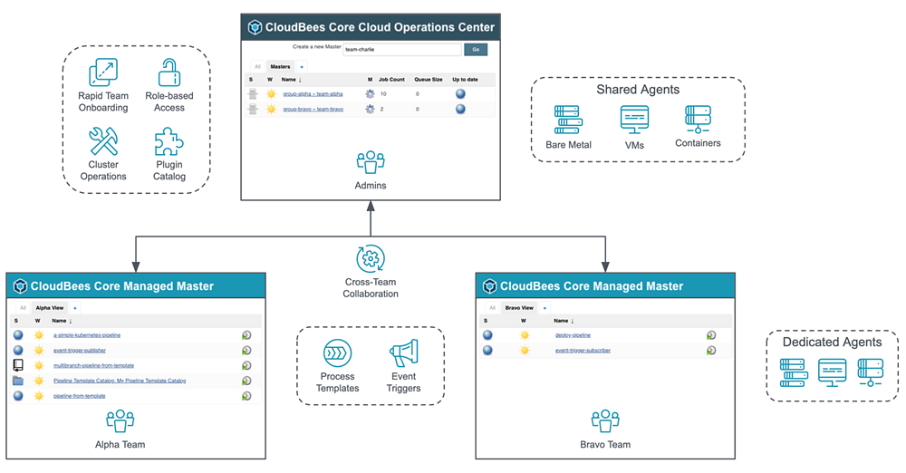
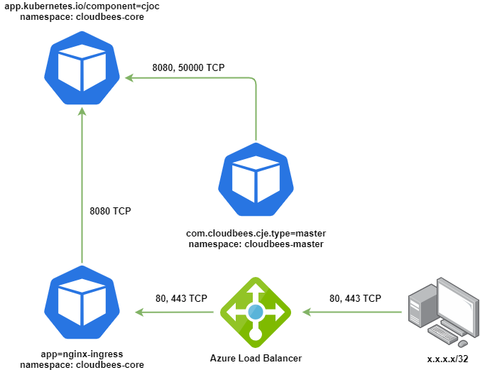

# cloudbees-k8s


A repository used for deploying CloudBees Core on Azure AKS cluster.

# Usage

* [Deploy Azure Storage Class](#deploy-azure-storage-class)
* [Deploy NGINX Ingress Controller](#deploy-nginx-ingress-controller)
* [Deploy cert-manager](#deploy-cert-manager)
* [Deploy CloudBees Core](#deploy-cloudbees-core)
* [Deploy Managed Master](#deploy-managed-master)
    * [Deploy Master NGINX Ingress Controller](#deploy-master-nginx-ingress-controller)
    * [Issue Managed Master Certificate](#issue-managed-master-certificate)
    * [Deploy Master K8s Resources](#deploy-master-k8s-resources)
    * [Deploy Managed Master via UI](#deploy-managed-master-via-ui)
    * [Configure Master](#configure-master)
* [Deploy External JNLP Agent](#deploy-external-jnlp-agent)
    * [Configure Agent](#configure-agent)
    * [Configure Java](#configure-java)
    * [Launch JNLP Agent via Console](#launch-jnlp-agent-via-console)
* [Network Policies](#network-policies)
    * [Deny All per Namespace](#deny-all-per-namespace)
        * [Deny All on default Namespace](#deny-all-on-default-namespace)
        * [Deny All on kube-system Namespace](#deny-all-on-default-namespace)
        * [Deny All on cert-manager Namespace](#deny-all-on-cert-manager-namespace)
        * [Deny All on cloudbees-core Namespace](#deny-all-on-cloudbees-core-namespace)
        * [Deny All on cloudbees-master Namespace](#deny-all-on-cloudbees-master-namespace)
    * [kube-system Network Policy](#kube-system-network-policy)
        * [kube-dns Network Policy](#kube-dns-network-policy)
        * [metrics-server Network Policy](#metrics-server-network-policy)
        * [kube-proxy Network Policy](#kube-proxy-network-policy)
    * [CloudBees CJOC Network Policy](#cloudbees-cjoc-network-policy)
    * [Ingress Controller Network Policy](#ingress-controller-network-policy)
    * [CloudBees Managed Master Network Policy](#cloudbees-managed-master-network-policy)
    * [Ingress Master Controller Network Policy](#ingress-master-controller-network-policy)

## Deploy Azure Storage Class

To define different tiers of storage, such as Premium and Standard, you can
create a **StorageClass**. The StorageClass also defines the reclaimPolicy.
This reclaimPolicy controls the behavior of the underlying Azure storage
resource when the pod is deleted and the persistent volume may no longer be
required. The underlying storage resource can be deleted, or retained for use
with a future pod.

In AKS, two initial StorageClasses are created:

* **default** - Uses Azure Standard storage to create a Managed Disk. The
  reclaim policy indicates that the underlying Azure Disk is deleted when the
  persistent volume that used it is deleted.
* **managed-premium** - Uses Azure Premium storage to create Managed Disk. The
  reclaim policy again indicates that the underlying Azure Disk is deleted when
  the persistent volume that used it is deleted.


If no StorageClass is specified for a persistent volume, the default
StorageClass is used. Take care when requesting persistent volumes so that they
use the appropriate storage you need. You can create a StorageClass for
additional needs using kubectl.

```
$ kubectl apply --filename='./storage-class.yml'
```

Verify that the storage class was provisioned with the correct attributes. We
are looking for the **ReclaimPolicy** attribute to be set to **Retain** and the
**AllowVolumeExpansion** attribute to be set to **True**.

```
$ kubectl describe storageclass managed-premium-retain

Name:            managed-premium-retain
IsDefaultClass:  No

Provisioner:           kubernetes.io/azure-disk
Parameters:            kind=Managed,storageaccounttype=Premium_LRS
AllowVolumeExpansion:  True
MountOptions:          <none>
ReclaimPolicy:         Retain
VolumeBindingMode:     Immediate
Events:                <none>
```

[Back to top](#usage)

## Deploy NGINX Ingress Controller

In Kubernetes, an **Ingress** is an object that allows access to your
Kubernetes services from outside the Kubernetes cluster. You configure access
by creating a collection of rules that define which inbound connections reach
which services.

This lets you consolidate your routing rules into a single resource. For
example, you might want to send requests to example.com/api/v1/ to an api-v1
service, and requests to example.com/api/v2/ to the api-v2 service. With an
Ingress, you can easily set this up without creating a bunch of LoadBalancers
or exposing each service on the Node.


Make sure you have the stable repo added to your Helm client.

```
$ helm repo add stable https://kubernetes-charts.storage.googleapis.com
$ helm repo update
```

Create a namespace to house the resources created by the nginx-ingress Helm
chart. In this tutorial we will be using Ingress controller per namespace and
hence will deploy it to the cloudbees-core namespace. The Ingress controller
will be using a defined scope to watch for Ingress on the cloudbees-core
namespace only.

```
$ kubectl create namespace cloudbees-core
```

Deploy the nginx-ingress Helm chart. You can specify the version that you
desire to deploy. By specifying a version, you are able to track what version
of the chart you deployed. It is recommended to include a version when
deploying a Helm chart.

Linux:

```
$ helm install ingress-cloudbees stable/nginx-ingress \
    --namespace cloudbees-core \
    --values ./nginx-ingress/values.yml \
    --version 1.34.3
```

Windows (PowerShell):

```
PS> helm install ingress-cloudbees stable/nginx-ingress `
      --namespace cloudbees-core `
      --values .\nginx-ingress\values.yml `
      --version 1.34.3
```

Verify that the Ingress controller was deployed successfully. Note that the
service name includes the name of the chart deployed followed by
**-nginx-ingress-controller**. Replace the service name with the name of the
chart you used to deploy the Ingress controller.

Linux:

```
$ kubectl get service ingress-cloudbees-nginx-ingress-controller \
    --namespace cloudbees-core \
    --output=jsonpath="{.status.loadBalancer.ingress[0].ip}"
```

Windows (PowerShell):

```
PS> kubectl get service ingress-cloudbees-nginx-ingress-controller `
      --namespace cloudbees-core `
      --output=jsonpath="{.status.loadBalancer.ingress[0].ip}"
```

The command should of returned an IP address that was used to expose the
Ingress controller. Verify that you can hit the **default backend** of the
Ingress controller.

Linux:

```
$ curl --verbose ${IP_ADDRESS}/healthz
```

Windows (PowerShell):

```
PS> Invoke-WebRequest -Uri ${IP_ADDRESS}/healthz
```

You should have received a **HTTP 200** OK response code. On Linux, make sure
to use the verbose flag with curl (--verbose).

[Back to top](#usage)

## Deploy cert-manager

**cert-manager** is a Kubernetes addon to automate the management and issuance
of TLS certificates from various issuing sources. It will ensure certificates
are valid and up to date periodically, and attempt to renew certificates at an
appropriate time before expiry.

**Issuers**, and **ClusterIssuers**, are Kubernetes resources that represent
certificate authorities (CAs) that are able to generate signed certificates by
honoring certificate signing requests. All cert-manager certificates require a
referenced issuer that is in a ready condition to attempt to honor the request.

An Issuer is a namespaced resource, and it is not possible to issue
certificates from an Issuer in a different namespace. This means you will need
to create an Issuer in each namespace you wish to obtain Certificates in.

cert-manager has the concept of **Certificates** that define a desired x509
certificate which will be renewed and kept up to date. A Certificate is a
namespaced resource that references an **Issuer** or **ClusterIssuer** that
determine what will be honoring the certificate request.

When a Certificate is created, a corresponding **CertificateRequest** resource
is created by cert-manager containing the encoded x509 certificate request,
Issuer reference, and other options based upon the specification of the
Certificate resource.


Create a namespace to house the resources created by the cert-manager Helm
chart.

```
$ kubectl create namespace cert-manager
```

Install the CustomResourceDefinition resources separately.

Linux:

```
$ kubectl apply \
    --validate=false \
    --filename=https://github.com/jetstack/cert-manager/releases/download/v0.14.0/cert-manager.crds.yaml
```

Windows (PowerShell):

```
PS> kubectl apply `
      --validate=false `
      --filename=https://github.com/jetstack/cert-manager/releases/download/v0.14.0/cert-manager.crds.yaml
```

Add the jetstack Helm repository.

```
$ helm repo add jetstack https://charts.jetstack.io
$ helm repo update
```

Deploy the cert-manager Helm chart and issue your first certificate. You have
the choice of issuing a certificate managed by Let's Encrypt or a selfsigned
certificate. If you choose to issue a selfsigned certificate, make sure to
distribute the Certificate Authority (CA).

Make sure to update the values in **./cert-manager/cloudbees-selfsigning.yml**
to reflect the domain name that you are using. Change the  **commonName** and
**dnsNames** to reflect your domain name.

Linux:

```
$ helm install cert-manager jetstack/cert-manager \
    --namespace cert-manager \
    --values ./cert-manager/values.yml \
    --version v0.14.1

$ kubectl apply --filename='./cert-manager/cloudbees-selfsigning.yml'
```

Windows (PowerShell):

```
PS> helm install cert-manager jetstack/cert-manager `
      --namespace cert-manager `
      --values .\cert-manager\values.yml `
      --version v0.14.1

PS> kubectl apply --filename='.\cert-manager\cloudbees-selfsigning.yml'
```

Verify that the issuer and certificate was generated in the cloudbees-core
namespace. Make sure you wait for the certificate to be generated.

```
$ kubectl get issuer --namespace cloudbees-core

NAME                 READY   AGE
selfsigning-issuer   True    5h42m

$ kubectl get certificate --namespace cloudbees-core

NAME            READY   SECRET          AGE
cloudbees-tls   True    cloudbees-tls   5h43m
```

Fetch the selfsigned CA certificate and import it to the Trusted Root
Certification Authorities store. Refer to 
[How to manage Trusted Root Certificates in Windows 10](https://www.thewindowsclub.com/manage-trusted-root-certificates-windows)
to import the CA certificate in Windows 10.

Linux:

```
$ kubectl get secret cloudbees-tls \
    --namespace cloudbees-core \
    --output=jsonpath="{.data.ca\.crt}" \
    | base64 --decode
```

Windows (PowerShell):

```
PS> $certificate = kubectl get secret cloudbees-tls `
      --namespace cloudbees-core `
      --output=jsonpath="{.data.ca\.crt}"

PS> [System.Text.Encoding]::UTF8.GetString([System.Convert]::FromBase64String($certificate))
```

[Back to top](#usage)

## Deploy CloudBees Core

CloudBees Core is a fully-featured, cloud native CD solution that can be hosted
on-premise or in the public cloud. It provides a shared, centrally managed,
self-service experience for all your development teams. CloudBees Core on
modern cloud platforms is designed to run on Kubernetes.

By default, the CloudBees Core Helm chart uses HTTP. To use HTTPS, you must
enable the TLS support and provide your TLS certificate before you install.



Add the cloudbees Helm repository.

```
$ helm repo add cloudbees https://charts.cloudbees.com/public/cloudbees
$ helm repo update
```

Make sure you update the **HostName** value in **./cloudbees/values.yml**
to reflect the domain name that you are using for your CloudBees instance.

Deploy the cloudbees-core Helm chart.

Linux:

```
$ helm install cloudbees-core cloudbees/cloudbees-core \
    --namespace cloudbees-core \
    --values ./cloudbees/values.yml \
    --version 3.12.0+80c17a044bc4
```

Windows (PowerShell):

```
PS> helm install cloudbees-core cloudbees/cloudbees-core \
      --namespace cloudbees-core \
      --values .\cloudbees\values.yml \
      --version 3.12.0+80c17a044bc4
```

Verify that the deployment was successful, make sure that the ingress has an
IP address allocated. You need to check that the **cjoc-0** pod is running.

```
$ kubectl get all --namespace cloudbees-core
$ kubectl get ingress --namespace cloudbees-core

NAME   HOSTS                        ADDRESS      PORTS     AGE
cjoc   jenkins.blueskysilkart.com   10.240.0.4   80, 443   22h
```

[Back to top](#usage)

## Deploy Managed Master

One of the benefits of CloudBees Core is the easy provisioning of new Jenkins
Managed masters from the Operations Center web interface. This feature is
provided by the CloudBees Core Master Provisioning Plugin for Jenkins. When you
provision a new master, you must specify the amount of memory and CPU to be
allocated to the new master, and the provisioning plugin will call upon the
Kubernetes API to create a master.

The diagram below shows what happens when a new Master is launched via
Operations Center. First, CJOC’s Master Provisioning Kubernetes Plugin calls
Kubernetes to provision a new StatefulSet to run the Managed Master Pod.


Create a namespace to house the resources created by the Master Provisioning
Kubernetes Plugin.

```
$ kubectl create namespace cloudbees-master
```

[Back to top](#usage)

### Deploy Master NGINX Ingress Controller

Make sure to update the **ingressClass**, **namespace scope**,
**configMapNamespace**, and the namespace of the service used by the Managed
master under **tcp 50001** in **./nginx-ingress/values-master.yml** to reflect
your namespace and naming conventions used.

It is crucial that you use the correct value in the tcp stanza. The Ingress
controller will expose port 50001 and route traffict to the **master-jnlp**
service under the **cloudbees-master** namespace. If you create a master with
the name **devops**, a service **devops-jnlp** will be provisioned. Make sure
you specify the correct namespace and service name. The external JNLP agent
will fail to connect to the master, if the values specified are incorrect.

Example using master with name devops:

```
tcp:
  50001: cloudbees-master/devops-jnlp:50001
```

Linux:

```
$ helm repo add stable https://kubernetes-charts.storage.googleapis.com
$ helm repo update

$ helm install ingress-master stable/nginx-ingress \
    --namespace cloudbees-master \
    --values ./nginx-ingress/values-master.yml \
    --version 1.34.3
```

Windows (PowerShell):

```
PS> helm repo add stable https://kubernetes-charts.storage.googleapis.com
PS> helm repo update

PS> helm install ingress-master stable/nginx-ingress `
      --namespace cloudbees-master `
      --values .\nginx-ingress\values-master.yml `
      --version 1.34.3
```

Verify that the Ingress controller was deployed successfully. Note that the
service name includes the name of the chart deployed followed by
**-nginx-ingress-controller**. Replace the service name with the name of the
chart you used to deploy the Ingress controller.

Linux:

```
$ kubectl get service ingress-master-nginx-ingress-controller \
    --namespace cloudbees-master \
    --output=jsonpath="{.status.loadBalancer.ingress[0].ip}"
```

Windows (PowerShell):

```
PS> kubectl get service ingress-master-nginx-ingress-controller `
      --namespace cloudbees-master `
      --output=jsonpath="{.status.loadBalancer.ingress[0].ip}"
```

The command should of returned an IP address that was used to expose the
Ingress controller. Verify that you can hit the **default backend** of the
Ingress controller.

Linux:

```
$ curl --verbose ${IP_ADDRESS}/healthz
```

Windows (PowerShell):

```
PS> Invoke-WebRequest -Uri ${IP_ADDRESS}/healthz
```

You should have received a **HTTP 200** OK response code. On Linux, make sure
to use the verbose flag with curl (--verbose).

[Back to top](#usage)

### Issue Managed Master Certificate

Before proceeding with the next step, make sure that you have cert-manager
deployed on the cluster. Refer to
[Deploy cert-manager](#deploy-cert-manager)

```
$ helm ls --all-namespaces
$ kubectl get all --all-namespaces
```

Issue a certificate for the managed master. Make sure to update the values in
**./cert-manager/cloudbees-selfsigning-master.yml** to reflect the subdomain
name that you are using for the master. Change the  **commonName** and
**dnsNames** to reflect your subdomain name. Also you can modify the
**namespace** for the **Issuer** and **Certificate** k8s resources.

```
$ kubectl apply --filename='./cert-manager/cloudbees-selfsigning-master.yml'
```

Verify that the issuer and certificate was generated in the cloudbees-master
namespace. Make sure you wait for the certificate to be generated.

```
$ kubectl get issuer --namespace cloudbees-master

NAME                 READY   AGE
selfsigning-issuer   True    22h

$ kubectl get certificate --namespace cloudbees-master

NAME         READY   SECRET       AGE
master-tls   True    master-tls   22h
```

Fetch the selfsigned CA certificate and import it to the Trusted Root
Certification Authorities store. Refer to 
[How to manage Trusted Root Certificates in Windows 10](https://www.thewindowsclub.com/manage-trusted-root-certificates-windows)
to import the CA certificate in Windows 10.

Linux:

```
$ kubectl get secret master-tls \
    --namespace cloudbees-master \
    --output=jsonpath="{.data.ca\.crt}" \
    | base64 --decode
```

Windows (PowerShell):

```
PS> $certificate = kubectl get secret master-tls `
      --namespace cloudbees-master `
      --output=jsonpath="{.data.ca\.crt}"

PS> [System.Text.Encoding]::UTF8.GetString([System.Convert]::FromBase64String($certificate))
```

[Back to top](#usage)

### Deploy Master K8s Resources

Managed masters are by default created in the same namespace as the Operations
Center instance. If you want to create a managed master in a different
namespace, you need to pre-populate the namespace with the appropriate
resources using Helm.

Make sure you update the **HostName** value in **./cloudbees/values-master.yml**
to reflect the subdomain name that you are using for your Managed master. Also
make sure that the **OperationsCenterNamespace** value is pointing to the
namespace where the Operations Center is deployed. 

Note that the **serviceAccountName** value needs to reflect the SA being used
to manage the Operations Center. If you don't provide the correct SA, the
Managed master will fail to deploy due to the RBAC measures being enforced.

Deploy the necessary resources for the Managed master.

Linux:

```
$ helm repo add cloudbees https://charts.cloudbees.com/public/cloudbees
$ helm repo update

$ helm install cloudbees-master cloudbees/cloudbees-core \
    --namespace cloudbees-master \
    --values ./cloudbees/values-master.yml \
    --version 3.12.0+80c17a044bc4
```

Windows (PowerShell):

```
PS> helm repo add cloudbees https://charts.cloudbees.com/public/cloudbees
PS> helm repo update

PS> helm install cloudbees-master cloudbees/cloudbees-core `
      --namespace cloudbees-master `
      --values .\cloudbees\values-master.yml `
      --version 3.12.0+80c17a044bc4
```

[Back to top](#usage)

### Deploy Managed Master via UI

To provision masters in their own projects, each master must use a specific
subdomain. For example, if the Operations Center domain is cloudbees.ddns.net
and the URL is https://cloudbees.ddnsnet/cjoc/, a master dev1 needs to use
the one of the following subdomain standards:

```
dev1.cloudbees.ddns.net
dev1-cloudbees.ddns.net
```

when using multiple Ingress controllers.

To configure each master to use a specific subdomain, set the 
**Master URL Pattern** in the main Jenkins configuration page:

```
Manage Jenkins -> Configure System
```

under **Kubernetes Master Provisioning options**. For example if the
Operations Center domain is cloudbees.ddns.net, the Master URL Pattern would
be the following:

```
https://*.cloudbees.ddns.net/*/
```

note the wildcard * being used.


Click on the **Save** button near the end of the page to save the changes.

You are now ready to deploy a Managed master. The deployment is done through the
UI by navigating to the homepage of the Operations Center, for example:

```
https://cloudbees.ddnsnet/cjoc/
```

Click on the **New Master...** button located near the top right of the page.
Enter a name for your Managed master. Be sure to use the same value you
specified for your subdomain name. For example you would use **master** as the
name of the Managed master, if your subdomain name is:

```
https://master.cloudbees.ddns.net
```

[Back to top](#usage)

### Configure Master

You will be redirected to the configuration page for your new Managed master.
Make sure you fill out the necessary form fields that are required. You can
optionally set the Display Name, if needed. You will notice that the **Domain**
form field was prepopulated with the name of the Managed master.

Make sure to specify the **Namespace** form field to the namespace where the
Managed master will be provisioned. If you will be using external agents, make
sure to tick the **Allow external agents** checkbox.

In order to provision a Managed master per namespace, you will need to use the
**./nginx-ingress/cloudbees-ingress-master.yml** template file. Make sure you
update the **ingress.class** and **hosts** value reflect your namespace and
subdomain name being used. You will need to copy and paste the contents of the
YAML file into the **Advanced configuration** section. There is a YAML form
field where you can add your own custom YAML code.


By default the master will have 0 executors enabled. This is a security
recommendation by CloudBees to prevent jobs running on the master from
modifying the master’s configuration. Click on the **Save** button, you will be
redirected to the info page of the master. Wait for the master to provision,
you can monitor the logs by clicking on the **Log** clipboard icon.

Verify that the deployment was successful, make sure that the ingress has an
IP address allocated. You need to check that the **devops-0** pod is running.
The pod will have the name of the master followed by a 0, example **master-0**.

```
$ kubectl get all --namespace cloudbees-master
$ kubectl get ingress --namespace cloudbees-master

NAME     HOSTS                               ADDRESS      PORTS     AGE
devops   devops.jenkins.blueskysilkart.com   10.240.0.4   80, 443   21h
```

[Back to top](#usage)

## Deploy External JNLP Agent

An agent is a computer that is set up to offload build projects from the master
and once setup this distribution of tasks is fairly automatic. The exact
delegation behavior depends on the configuration of each project; some projects
may choose to stick to a particular machine for a build, while others may
choose to roam freely between agents.

The most popular ways agents are configured are via connections that are
initiated from the master. This allows agents to be minimally configured and
the control lives with the master. This does require that the master have
network access (ingress) to the agent (typically this is via ssh). In some
cases this is not desirable due to security network rules, in which case you
can use Agent to master connections via **JNLP**.


[Back to top](#usage)

### Configure Agent

You will need to go to the homepage of the master. The master can be reached by
going to the homepage of the Operations center and clicking on the name of the
master under the **Masters** tab. You can also reach the master by going
directly to the URL of the master.

```
https://cloudbees.ddnsnet/cjoc/        - Operations Center
https://devops.cloudbees.ddnsnet/cjoc/ - devops master
```

Once you are on the homepage for the master, you will need to go to the
Manage Nodes and Clouds configuration page.

```
Manage Jenkins -> Manage Nodes and Clouds
```

Click on the computer icon (New Node) located on the left side navigation
panel. Enter the name of the agent on the **Node name** form field. Select
the **Permanent Agent** radio button and click on the **OK** button. You will
be redirected to the configuration page for the agent.

The Name form field will be populated from the previous inputs you entered.
Make sure you review the number of executors you would like to provision. By
default 1 executor will be provisioned for an agent. Depending on the operating
system being used, specify a valid directory local to the agent machine. Make
sure to specify an **absolute path**:

Linux:

```
/opt/jenkins/mr-robot
```

Windows (PowerShell):

```
C:\jenkins\mr-robot
```

Agents do not maintain important data; all job configurations, build logs and
artifacts are stored on the master, so it would be possible to use a temporary
directory as the agent root directory. However, by giving an agent a directory
that is not deleted after a machine reboot, for example, the agent can cache
data such as tool installations, or build workspaces. This prevents unnecessary
downloading of tools, or checking out source code again when builds start to
run on this agent again after a reboot.

It is recommended that you specify labels for the agent.

Labels (or tags) are used to group multiple agents into one logical group. For
example, if you have multiple Windows agents and you have a job that must run
on Windows, then you could configure all your Windows agents to have the label
windows, and then tie that job to this label. This would ensure that your job
runs on one of your Windows agents, but not on any agents without this label.

You can specify the usage,

* **Use this node as much as possible**
  * This is the default setting. 
  * In this mode, Jenkins uses this node freely. Whenever there is a build
    that can be done by using this node, Jenkins will use it.
* **Only build jobs with label expressions matching this node**
  * In this mode, Jenkins will only build a project on this node when that
    project is restricted to certain nodes using a label expression, and that
    expression matches this node's name and/or labels.
  * This allows a node to be reserved for certain kinds of jobs.

The recommended value for **Launch method** is Launch agent by connecting it
to the master. This means that the agent need not be reachable from the master;
the agent just needs to be able to reach the master.

Save the configuration of the agent by clicking on the **Save** button near the
end of the page. You will be redirected to the page with instructions on how to
launch the agent. We still need to configure Java before we proceed with
launching the agent.

[Back to top](#usage)

### Configure Java

You can skip this step if using a **Docker container** to connect to the
master.

There are multiple methods for connecting a JNLP agent to a master. We will
first look at using a local Windows machine with Java installed. Make sure you
have the latest Java Runtime Environment installed. Refer to 
[Download Java](https://www.java.com/en/download/) for the latest available
release.

In order to be able to communicate with the master, you will need to import the
certificate to the Java keystore. This step can be skipped, if using
Let's Encrypt or a trusted CA.


A Java Keystore is a container for authorization certificates or public key
certificates, and is often used by Java-based applications for encryption,
authentication, and serving over HTTPS. Its entries are protected by a keystore
password. A keystore entry is identified by an alias, and it consists of keys
and certificates that form a trust chain.

By default the keytool executable is not in the path, which means you wont be
able to execute the command. Make sure to verify that you can execute the
keytool command. Also verify the version of Java you have installed. You can
add the keytool executable to your path by using PowerShell.

```
PS> java -version

java version "1.8.0_241"
Java(TM) SE Runtime Environment (build 1.8.0_241-b07)
Java HotSpot(TM) Client VM (build 25.241-b07, mixed mode)

PS> $JAVA_HOME = "C:\Program Files (x86)\Java\jre1.8.0_241"

PS> [Environment]::SetEnvironmentVariable("Path", $env:Path + ";${JAVA_HOME}\bin\", "User")
PS> [Environment]::SetEnvironmentVariable("JAVA_HOME", "$JAVA_HOME", "User")

PS> $machine_env = [System.Environment]::GetEnvironmentVariable("Path","Machine")
PS> $user_env = [System.Environment]::GetEnvironmentVariable("Path","User")

PS> $env:Path = $machine_env + ";" + $user_env
PS> $env:JAVA_HOME = $JAVA_HOME
```

The default password used by the Java keystore is **changeit**. This is not
secure by default but you are able to change the password.

Linux:

```
$ sudo keytool -storepasswd \
    -keystore /etc/ssl/certs/java/cacerts
```

Windows (PowerShell):

```
PS> keytool -storepasswd `
      -keystore "${env:JAVA_HOME}\lib\security\cacerts"
```

You are now ready to import the certificate of the master to the Java keystore.
When importing the certificate, make sure to verify the attributes displayed.
If the certificate matches, you can type yes to approve the certificate trust.

Linux:

```
$ keytool -import \
  -trustcacerts \
  -keystore "/etc/ssl/certs/java/cacerts" \
  -alias devops.jenkins.blueskysilkart.com \
  -file ./cloudbees-master.crt
```

Windows (PowerShell):

```
PS > keytool -import `
  -trustcacerts `
  -keystore "${env:JAVA_HOME}\lib\security\cacerts" `
  -alias devops.jenkins.blueskysilkart.com `
  -file .\cloudbees-master.crt

Trust this certificate? [no]:  yes
Certificate was added to keystore
```

[Back to top](#usage)

### Launch JNLP Agent via Console

Before proceeding with launching an agent, you should have configured the agent
via the UI. Also if you are using a selfsigned certificate, you should have
imported the certificate to the Java keystore. Refer to
[Configure Java](#configure-java) section on how to import a certificate to the
Java keystore.

You will need to download the **agent.jar** file from the homepage of the agent.
Make sure to click on **Keep**, if the browser alerts you of the file. Also you
will need to fetch the **jnlpUrl**, **secret**, and **workDir** values.

Linux:

```
$ java -jar agent.jar \
    -jnlpUrl https://devops.jenkins.blueskysilkart.com/devops/computer/Mr.Robot/slave-agent.jnlp \
    -secret $SECRET \
    -workDir "/opt/jenkins/mr-robot"

INFO: Agent discovery successful
  Agent address: devops.jenkins.blueskysilkart.com
  Agent port:    50001
  Identity:      92:72:c5:85:1b:eb:ee:d1:a9:f9:f3:cc:75:a2:c9:e6
Apr 03, 2020 6:18:23 PM hudson.remoting.jnlp.Main$CuiListener status
INFO: Handshaking
Apr 03, 2020 6:18:23 PM hudson.remoting.jnlp.Main$CuiListener status
INFO: Connecting to devops.jenkins.blueskysilkart.com:50001
Apr 03, 2020 6:18:23 PM hudson.remoting.jnlp.Main$CuiListener status
INFO: Trying protocol: JNLP4-connect
Apr 03, 2020 6:18:23 PM hudson.remoting.jnlp.Main$CuiListener status
INFO: Remote identity confirmed: 92:72:c5:85:1b:eb:ee:d1:a9:f9:f3:cc:75:a2:c9:e6
Apr 03, 2020 6:18:24 PM hudson.remoting.jnlp.Main$CuiListener status
INFO: Connected
```

Windows (PowerShell):

```
PS > java -jar agent.jar `
  -jnlpUrl https://devops.jenkins.blueskysilkart.com/devops/computer/windows-box/slave-agent.jnlp `
  -secret $SECRET `
  -workDir "C:\Jenkins\windows-box"

INFO: Agent discovery successful
  Agent address: devops.jenkins.blueskysilkart.com
  Agent port:    50001
  Identity:      92:72:c5:85:1b:eb:ee:d1:a9:f9:f3:cc:75:a2:c9:e6
Apr 03, 2020 5:24:58 PM hudson.remoting.jnlp.Main$CuiListener status
INFO: Handshaking
Apr 03, 2020 5:24:58 PM hudson.remoting.jnlp.Main$CuiListener status
INFO: Connecting to devops.jenkins.blueskysilkart.com:50001
Apr 03, 2020 5:24:59 PM hudson.remoting.jnlp.Main$CuiListener status
INFO: Trying protocol: JNLP4-connect
Apr 03, 2020 5:24:59 PM hudson.remoting.jnlp.Main$CuiListener status
INFO: Remote identity confirmed: 92:72:c5:85:1b:eb:ee:d1:a9:f9:f3:cc:75:a2:c9:e6
Apr 03, 2020 5:25:00 PM hudson.remoting.jnlp.Main$CuiListener status
INFO: Connected
```

Verify that the agent was added, click on **Back to list** located on the left
side navigation panel. You should see the agent listed as online. You might
need to wait for the agent to synchronize with the master, refresh the page if
needed.


[Back to top](#usage)

## Network Policies

When you run modern, microservices-based applications in Kubernetes, you often
want to control which components can communicate with each other. The principle
of least privilege should be applied to how traffic can flow between pods in an
Azure Kubernetes Service (AKS) cluster. Let's say you likely want to block
traffic directly to back-end applications. The Network Policy feature in
Kubernetes lets you define rules for ingress and egress traffic between pods in
a cluster.

All pods in an AKS cluster can send and receive traffic without limitations, by
default. To improve security, you can define rules that control the flow of
traffic. Back-end applications are often only exposed to required front-end
services, for example. Network policies do not conflict, they are additive. If
any policy or policies select a pod, the pod is restricted to what is allowed
by the union of those policies ingress/egress rules. Thus, order of evaluation
does not affect the policy result.

[Back to top](#usage)

### Deny All per Namespace 

It is recommended to block all network traffic by default. In order to
accomplish this, you need to define a network policy per namespace that blocks
all ingress traffic. We can begin by denying all traffic on the default and
kube-system namespace.

##### Determine CIDR Used by the Cluster

Before deploying the **deny-all.yml** network policy, you will need to
determine the **cluster CIDR range**.

```
$ kubectl cluster-info dump | grep "cluster-cidr"
```

Windows (PowerShell):

```
PS> kubectl cluster-info dump | Select-String "cluster-cidr"
```

Make sure to update the **cidr** under **ipBlock** with the
**cluster CIDR range** of your cluster.

Deploy the deny-all network policy on the default namespace.

```
$ kubectl apply --filename='./deny-all-netpol.yml'
```

There are five network policies that are deployed from the
**deny-all-netpol.yml** file. In this section we will focus on the two deny-all
network polcies. The first policy will deny all non-whitelisted traffic on the
**default** namespace. The second policy will deny all non-whitelisted traffic
on the **kube-system** namespace.

[Back to top](#usage)

#### Deny All on default Namespace

Verify that the deny-all network policy was deployed in the **default**
namespace.

```
$ kubectl describe netpol deny-all

Name:         deny-all
Namespace:    default
Created on:   2020-04-23 10:57:44 -0700 MST
Labels:       <none>
Annotations:  kubectl.kubernetes.io/last-applied-configuration:
                {"apiVersion":"networking.k8s.io/v1","kind":"NetworkPolicy","metadata":{"annotations":{},"name":"deny-all","namespace":"default"},"spec":{...
Spec:
  PodSelector:     <none> (Allowing the specific traffic to all pods in this namespace)
  Allowing ingress traffic:
    <none> (Selected pods are isolated for ingress connectivity)
  Not affecting egress traffic
  Policy Types: Ingress
```

The **deny-all network policy** denies all non-whitelisted ingress traffic on
the default namespace. This will prevent exposing pods on the default
namespace.

Verify that the deny-all network policy is blocking all traffic by default.

Linux:

```
$ kubectl run backend \
    --image=nginx \
    --labels app=webapp,role=backend \
    --expose \
    --port 80 \
    --generator=run-pod/v1

$ kubectl run \
    --rm -it \
    --image=alpine network-policy \
    --generator=run-pod/v1

/ # wget -qO- --timeout=2 http://backend
wget: download timed out
```

Windows (PowerShell):

```
PS> kubectl run backend `
      --image=nginx `
      --labels app=webapp,role=backend `
      --expose `
      --port 80 `
      --generator=run-pod/v1

PS> kubectl run `
      --rm -it `
      --image=alpine network-policy `
      --generator=run-pod/v1

/ # wget -qO- --timeout=2 http://backend
wget: download timed out
```

The wget command on the pod should eventually timeout when trying to
communicate with another pod on the same namespace. Don't forget to clean up
the default namespace, after testing the network policy.

[Back to top](#usage)

#### Deny All on kube-system Namespace

Verify that the deny-all network policy was deployed in the **kube-system**
namespace.

```
$ kubectl describe netpol deny-all --namespace kube-system

Name:         deny-all
Namespace:    kube-system
Created on:   2020-04-23 10:57:44 -0700 MST
Labels:       <none>
Annotations:  kubectl.kubernetes.io/last-applied-configuration:
                {"apiVersion":"networking.k8s.io/v1","kind":"NetworkPolicy","metadata":{"annotations":{},"name":"deny-all","namespace":"kube-system"},"spe...
Spec:
  PodSelector:     <none> (Allowing the specific traffic to all pods in this namespace)
  Allowing ingress traffic:
    <none> (Selected pods are isolated for ingress connectivity)
  Not affecting egress traffic
  Policy Types: Ingress
```

This policy is similar to the deny-all network policy in the default namespace.
All non-whitelisted ingress traffic is denied on the **kube-system** namespace.

[Back to top](#usage)

#### Deny All on cert-manager Namespace

Deploy the deny-all network policy on the cert-manager namespace.

```
$ kubectl apply --filename='./cert-manager/deny-all-netpol.yml'
```

Verify that the deny-all network policy was deployed in the **cert-manager**
namespace.

```
$ kubectl describe netpol deny-all --namespace cert-manager

Name:         deny-all
Namespace:    cert-manager
Created on:   2020-04-23 14:26:55 -0700 MST
Labels:       <none>
Annotations:  kubectl.kubernetes.io/last-applied-configuration:
                {"apiVersion":"networking.k8s.io/v1","kind":"NetworkPolicy","metadata":{"annotations":{},"name":"deny-all","namespace":"cert-manager"},"sp...
Spec:
  PodSelector:     <none> (Allowing the specific traffic to all pods in this namespace)
  Allowing ingress traffic:
    <none> (Selected pods are isolated for ingress connectivity)
  Not affecting egress traffic
  Policy Types: Ingress
```

This policy is similar to the deny-all network policy in the default namespace.
All non-whitelisted ingress traffic is denied on the **cert-manager** namespace.

[Back to top](#usage)

#### Deny All on cloudbees-core Namespace

This policy is part of the **cloudbees-core network policy**, refer to
[CloudBees CJOC Network Policy](#cloudbees-cjoc-network-policy) for deploying
the policy.

Verify that the deny-all network policy was deployed in the **cloudbees-core**
namespace.

```
$ kubectl describe netpol deny-all --namespace cloudbees-core

Name:         deny-all
Namespace:    cloudbees-core
Created on:   2020-04-09 10:26:51 -0700 MST
Labels:       <none>
Annotations:  kubectl.kubernetes.io/last-applied-configuration:
                {"apiVersion":"networking.k8s.io/v1","kind":"NetworkPolicy","metadata":{"annotations":{},"name":"deny-all","namespace":"cloudbees-core"},"...
Spec:
  PodSelector:     <none> (Allowing the specific traffic to all pods in this namespace)
  Allowing ingress traffic:
    <none> (Selected pods are isolated for ingress connectivity)
  Not affecting egress traffic
  Policy Types: Ingress
```

This policy is similar to the deny-all network policy in the default namespace.
All non-whitelisted ingress traffic is denied on the **cloudbees-core**
namespace. This is the namespace where we have deployed the
**CloudBees Jenkins Operations Center (CJOC)**.

[Back to top](#usage)

#### Deny All on cloudbees-master Namespace

This policy is part of the **cloudbees-master network policy**, refer to
[cloudbees-master Network Policy](#cloudbees-core-network-policy) for deploying
the policy.

Verify that the deny-all network policy was deployed in the
**cloudbees-master** namespace.

```
$ kubectl describe netpol deny-all --namespace cloudbees-master

Name:         deny-all
Namespace:    cloudbees-master
Created on:   2020-04-09 11:29:51 -0700 MST
Labels:       <none>
Annotations:  kubectl.kubernetes.io/last-applied-configuration:
                {"apiVersion":"networking.k8s.io/v1","kind":"NetworkPolicy","metadata":{"annotations":{},"name":"deny-all","namespace":"cloudbees-master"}...
Spec:
  PodSelector:     <none> (Allowing the specific traffic to all pods in this namespace)
  Allowing ingress traffic:
    <none> (Selected pods are isolated for ingress connectivity)
  Not affecting egress traffic
  Policy Types: Ingress
```

This policy is similar to the deny-all network policy in the default namespace.
All non-whitelisted ingress traffic is denied on the **cloudbees-master**
namespace. This is the namespace where we have deployed the
**CloudBees Managed Master**.

[Back to top](#usage)

### kube-system Network Policy

The **kube-system** namespace is used for Kubernetes components managed by
Kubernetes. As a general rule, avoid adding normal workloads to this namespace.
It is intended to be managed directly by the system and contains pods such as:
**kube-dns** (CoreDNS) and **kube-proxy**.


The **kube-system** network policy consists of three different network policies:
kube-dns, metrics-server, and kube-proxy.

[Back to top](#usage)

#### kube-dns Network Policy

Verify that the **kube-dns network policy** was deployed.

```
$ kubectl describe netpol kube-dns --namespace kube-system

Name:         kube-dns
Namespace:    kube-system
Created on:   2020-04-23 10:57:44 -0700 MST
Labels:       <none>
Annotations:  kubectl.kubernetes.io/last-applied-configuration:
                {"apiVersion":"networking.k8s.io/v1","kind":"NetworkPolicy","metadata":{"annotations":{},"name":"kube-dns","namespace":"kube-system"},"spe...
Spec:
  PodSelector:     k8s-app=kube-dns
  Allowing ingress traffic:
    To Port: 53/TCP
    To Port: 53/UDP
    From:
      IPBlock:
        CIDR: 10.240.0.0/16
        Except:
  Not affecting egress traffic
  Policy Types: Ingress
```

Make sure to update the **cidr** under **ipBlock** with the
**cluster CIDR range** of your cluster. Refer to
[Determine CIDR Used by the Cluster](#determine-cidr-used-by-the-cluster) to
fetch the CIDR range being used by the cluster.

The **kube-dns network policy** allows a specific range of IP addresses to
communicate with the kube-dns (CoreDNS) pod. The CIDR range used should be the
range of IP addresses allocated in your cluster. This policy allows only
traffic that is within the local network of the cluster. DNS requires both TCP
and UDP traffic on port 53. If this port is not allowed, the internal
Kubernetes DNS will fail to resolve pods in the cluster.

**CoreDNS** is a fast and flexible DNS server. The key word here is flexible:
with CoreDNS you are able to do what you want with your DNS data by utilizing
plugins. If some functionality is not provided out of the box you can add it by
writing a plugin.

**Azure Kubernetes Service (AKS)** uses the **CoreDNS project** for cluster DNS
management and resolution with all 1.12.x and higher clusters. Previously, the
**kube-dns** project was used.


[Back to top](#usage)

#### metrics-server Network Policy

Verify that the **metrics-server network policy** was deployed.

```
$ kubectl describe netpol metrics-server --namespace kube-system

Name:         metrics-server
Namespace:    kube-system
Created on:   2020-04-23 15:19:53 -0700 MST
Labels:       <none>
Annotations:  kubectl.kubernetes.io/last-applied-configuration:
                {"apiVersion":"networking.k8s.io/v1","kind":"NetworkPolicy","metadata":{"annotations":{},"name":"metrics-server","namespace":"kube-system"...
Spec:
  PodSelector:     k8s-app=metrics-server
  Allowing ingress traffic:
    To Port: 443/TCP
    From:
      IPBlock:
        CIDR: 10.240.0.0/16
        Except:
  Not affecting egress traffic
  Policy Types: Ingress
```

Make sure to update the **cidr** under **ipBlock** with the
**cluster CIDR range** of your cluster. Refer to
[Determine CIDR Used by the Cluster](#determine-cidr-used-by-the-cluster) to
fetch the CIDR range being used by the cluster.

The **metrics-server network policy** allows a specific range of IP addresses
to communicate with the metrics-server pod. The CIDR range used should be the
range of IP addresses allocated in your cluster. This policy allows only
traffic that is within the local network of the cluster. Port 443 is used by
the metrics-server to server the metrics data collected. If this port is not
allowed, the ```kubectl top``` command will fail to fetch metrics on the nodes.

Metrics Server is a scalable, efficient source of container resource metrics for
Kubernetes built-in autoscaling pipelines. Metrics Server collects resource
metrics from Kubelets and exposes them in **Kubernetes apiserver** through
Metrics API for use by Horizontal Pod Autoscaler and Vertical Pod Autoscaler.
Metrics API can also be accessed by **kubectl top**, making it easier to debug
autoscaling pipelines.

Metrics Server has specific requirements for cluster and network configuration.
These requirements aren't the default for all cluster distributions. Please
ensure that your cluster distribution supports these requirements before using
Metrics Server:

- Metrics Server must be reachable from kube-apiserver
- The kube-apiserver must be correctly configured to enable an aggregation
  layer
- Nodes must have kubelet authorization configured to match Metrics Server
  configuration
- Container runtime must implement a container metrics RPCs


[Back to top](#usage)

#### kube-proxy Network Policy

Verify that the **kube-proxy network policy** was deployed.

```
$ kubectl describe netpol kube-proxy --namespace kube-system

Name:         kube-proxy
Namespace:    kube-system
Created on:   2020-04-23 12:05:09 -0700 MST
Labels:       <none>
Annotations:  kubectl.kubernetes.io/last-applied-configuration:
                {"apiVersion":"networking.k8s.io/v1","kind":"NetworkPolicy","metadata":{"annotations":{},"name":"kube-proxy","namespace":"kube-system"},"s...
Spec:
  PodSelector:     component=kube-proxy
  Allowing ingress traffic:
    To Port: 10250/TCP
    To Port: 10256/TCP
    From:
      IPBlock:
        CIDR: 10.240.0.0/16
        Except:
  Not affecting egress traffic
  Policy Types: Ingress
```

Make sure to update the **cidr** under **ipBlock** with the
**cluster CIDR range** of your cluster. Refer to
[Determine CIDR Used by the Cluster](#determine-cidr-used-by-the-cluster) to
fetch the CIDR range being used by the cluster.

The **kube-proxy network policy** allows a specific range of IP addresses
to communicate with the kube-proxy pod. The CIDR range used should be the
range of IP addresses allocated in your cluster. This policy allows only
traffic that is within the local network of the cluster. Port 10250 is used
as an API to allow full node access. If this port is not allowed, you will not
be able to provision pods on the cluster. Port 10256 is used as a health check
server for kube-proxy.

Each node has a **kube-proxy** container process. (In the Kubernetes frame of
reference, that kube-proxy container is in a pod in the kube-system namespace.)
kube-proxy manages forwarding of traffic addressed to the virtual IP addresses
of the cluster’s Kubernetes Service objects to the appropriate backend
pods. kube-proxy currently supports three different operation modes:

- User space: This mode gets its name because the service routing takes place
  in kube-proxy in the user process space instead of in the kernel network
  stack. It is not commonly used as it is slow and outdated.
- iptables: This mode uses Linux kernel-level Netfilter rules to configure all
  routing for Kubernetes Services. This mode is the default for kube-proxy on
  most platforms. When load balancing for multiple backend pods, it uses
  unweighted round-robin scheduling.
- IPVS (IP Virtual Server): Built on the Netfilter framework, IPVS implements
  Layer-4 load balancing in the Linux kernel, supporting multiple
  load-balancing algorithms, including least connections and shortest expected
  delay. This kube-proxy mode became generally available in Kubernetes 1.11,
  but it requires the Linux kernel to have the IPVS modules loaded. It is also
  not as widely supported by various Kubernetes networking projects as the
  iptables mode.


[Back to top](#usage)

### CloudBees CJOC Network Policy

CloudBees Core includes the Operations Center that provisions and manages
CloudBees Managed Masters and Team Masters. CloudBees Core also enables Managed
Masters and Team Masters to perform dynamic provisioning of build agents via
Kubernetes.

In order for this network policy to work, you will need to label your namespace
with the appropriate lable.

```
$ kubectl label namespace cloudbees-core "name=cloudbees-core" --overwrite
```


Verify that the **cloudbees-core network policy** was deployed.

```
$ kubectl describe netpol cloudbees-core --namespace cloudbees-core

Name:         cloudbees-core
Namespace:    cloudbees-core
Created on:   2020-04-09 10:26:52 -0700 MST
Labels:       <none>
Annotations:  kubectl.kubernetes.io/last-applied-configuration:
                {"apiVersion":"networking.k8s.io/v1","kind":"NetworkPolicy","metadata":{"annotations":{},"name":"cloudbees-core","namespace":"cloudbees-co...
Spec:
  PodSelector:     app.kubernetes.io/component=cjoc,app.kubernetes.io/instance=cloudbees-core
  Allowing ingress traffic:
    To Port: 8080/TCP
    From:
      NamespaceSelector: name=cloudbees-core
      PodSelector: app=nginx-ingress,app.kubernetes.io/component=controller
    From:
      NamespaceSelector: name=cloudbees-master
      PodSelector: com.cloudbees.cje.tenant=devops,com.cloudbees.cje.type=master
    ----------
    To Port: 50000/TCP
    From:
      NamespaceSelector: name=cloudbees-master
      PodSelector: com.cloudbees.cje.tenant=devops,com.cloudbees.cje.type=master
  Not affecting egress traffic
  Policy Types: Ingress
```

The **cloudbees-core network policy** allows specific traffic to the cjoc pod
on the cloudbees-core namespace. The Ingress controller pod is only allowed to
redirect traffic to port **8080** on the **cjoc pod**. The master pod is
allowed to communicate on port **8080** and **50000** with the **cjoc pod**.

The communication on port 8080 is just regular HTTP traffic between the
Operations Center and Managed Master. The communication on port 50000 is known
as **Java Network Launch Protocol (JNLP)** traffic. The JNLP protocol is mostly
used for Agents/Slaves to communicate with the Master or Operations Center.



[Back to top](#usage)

### Ingress Controller Network Policy

Kubernetes Ingresses offer you a flexible way of routing traffic from beyond
your cluster to internal Kubernetes Services. Ingress Resources are objects in
Kubernetes that define rules for routing HTTP and HTTPS traffic to Services.
For these to work, an Ingress Controller must be present; its role is to
implement the rules by accepting traffic (most likely via a Load Balancer) and
routing it to the appropriate Services. Most Ingress Controllers use only one
global Load Balancer for all Ingresses, which is more efficient than creating a
Load Balancer per every Service you wish to expose.


By default the deny-all policy that was deployed on the cloudbees-core
namespace will block all incoming traffic. This means that when you try to hit
the Ingress Controller from outside, the traffic will be denied. To fix this
issue you will need to **whitelist** either a range of IP addresses or a single
IP address such as your office network IP.

Make sure to update the **cidr** under **ipBlock** in 
**nginx-ingress/ingress-controller-netpol.yml** file. For example you could add
a single IP address **x.x.x.x/32**.

Deploy the nginx-ingress network policy.

```
$ kubectl apply --filename='./nginx-ingress/ingress-controller-netpol.yml'
```

Verify that the **nginx-ingress network policy** was deployed.

```
$ kubectl describe netpol nginx-ingress --namespace cloudbees-core

Name:         nginx-ingress
Namespace:    cloudbees-core
Created on:   2020-04-09 10:26:12 -0700 MST
Labels:       <none>
Annotations:  kubectl.kubernetes.io/last-applied-configuration:
                {"apiVersion":"networking.k8s.io/v1","kind":"NetworkPolicy","metadata":{"annotations":{},"name":"nginx-ingress","namespace":"cloudbees-cor...
Spec:
  PodSelector:     app=nginx-ingress,app.kubernetes.io/component=controller
  Allowing ingress traffic:
    To Port: 80/TCP
    To Port: 443/TCP
    From:
      IPBlock:
        CIDR: x.x.x.x/32
        Except:
  Not affecting egress traffic
  Policy Types: Ingress
```

The **nginx-ingress network policy** allows specific traffic to the
nginx-ingress controller pod on the cloudbees-core namespace. Remeber we are
using Ingress Controller per namespace. The Ingress Controller exposes port
**80** and **443**, all ingress traffic will be redirected to the specified
service. If the service cannot be determined, the traffic will be redirected to
the **default bakend**.


[Back to top](#usage)

### CloudBees Managed Master Network Policy

When creating a Managed Master, you will need to define a network policy that
is secure enough to cover your infrastructure. The approach taken by this
repository is to create a Managed Master per namespace. I have included a
template for a network policy that should suffice the needs of most users.

In order for this network policy to work, you will need to label your namespace
with the appropriate lable.

```
$ kubectl label namespace cloudbees-master "name=cloudbees-master" --overwrite
```

Verify that the **cloudbees-master network policy** was deployed.

```
$ kubectl describe netpol cloudbees-master --namespace cloudbees-master

Name:         cloudbees-master
Namespace:    cloudbees-master
Created on:   2020-04-09 11:29:51 -0700 MST
Labels:       <none>
Annotations:  kubectl.kubernetes.io/last-applied-configuration:
                {"apiVersion":"networking.k8s.io/v1","kind":"NetworkPolicy","metadata":{"annotations":{},"name":"cloudbees-master","namespace":"cloudbees-...
Spec:
  PodSelector:     com.cloudbees.cje.tenant=devops,com.cloudbees.cje.type=master
  Allowing ingress traffic:
    To Port: 8080/TCP
    From:
      NamespaceSelector: name=cloudbees-master
      PodSelector: app=nginx-ingress,app.kubernetes.io/component=controller
    From:
      NamespaceSelector: name=cloudbees-core
      PodSelector: app.kubernetes.io/component=cjoc,app.kubernetes.io/instance=cloudbees-core
    From:
      NamespaceSelector: name=cloudbees-master
      PodSelector: jenkins=slave
    ----------
    To Port: 50000/TCP
    From:
      NamespaceSelector: name=cloudbees-master
      PodSelector: jenkins=slave
  Not affecting egress traffic
  Policy Types: Ingress
```

The **cloudbees-master network policy** allows specific traffic to the master
pod on the cloudbees-master namespace. The Ingress controller pod is only
allowed to redirect traffic to port **8080** on the **master pod**. The
Operations Center (cjoc) pod is allowed to communicate on port **8080** with
the **master pod**.

The communication on port 8080 is just regular HTTP traffic between the
Operations Center and Managed Master. The communication on port 50000 is known
as **Java Network Launch Protocol (JNLP)** traffic. The JNLP protocol is mostly
used for Agents/Slaves to communicate with the Master or Operations Center.

Note that the Agent/Slave requires both port 8080 and 50000 communication with
the master pod.


[Back to top](#usage)

### Ingress Master Controller Network Policy

When creating a Managed Master, you will need to deploy an Ingress Controller
on the same namespace where the master was deployed. I recommended the Ingress
Controller per namespace approach to offload the workload of the controller.

In this case, you will need to define a network policy for the Ingress
Controller used by your Managed Master. I have included a template for a
network policy that should suffice the needs of most users.

By default the deny-all policy that was deployed on the cloudbees-master
namespace will block all incoming traffic. This means that when you try to hit
the Ingress Controller from outside, the traffic will be denied. To fix this
issue you will need to **whitelist** either a range of IP addresses or a single
IP address such as your office network IP.

Make sure to update the **cidr** under **ipBlock** in 
**nginx-ingress/ingress-controller-netpol-master.yml** file. For example you
could add a single IP address **x.x.x.x/32**.

Deploy the nginx-ingress network policy.

```
$ kubectl apply --filename='./nginx-ingress/ingress-controller-master-netpol.yml'
```

Verify that the **nginx-ingress network policy** was deployed.

```
$ kubectl describe netpol nginx-ingress --namespace cloudbees-master

Name:         nginx-ingress
Namespace:    cloudbees-master
Created on:   2020-04-09 11:33:59 -0700 MST
Labels:       <none>
Annotations:  kubectl.kubernetes.io/last-applied-configuration:
                {"apiVersion":"networking.k8s.io/v1","kind":"NetworkPolicy","metadata":{"annotations":{},"name":"nginx-ingress","namespace":"cloudbees-mas...
Spec:
  PodSelector:     app=nginx-ingress,app.kubernetes.io/component=controller
  Allowing ingress traffic:
    To Port: 80/TCP
    To Port: 443/TCP
    To Port: 50001/TCP
    From:
      IPBlock:
        CIDR: x.x.x.x/32
        Except:
  Not affecting egress traffic
  Policy Types: Ingress
```

The **nginx-ingress network policy** allows specific traffic to the
nginx-ingress controller pod on the cloudbees-master namespace. Remeber we are
using Ingress Controller per namespace. The Ingress Controller exposes port
**80**, **443** and **50001**, all ingress traffic will be redirected to the
specified service. If the service cannot be determined, the traffic will be
redirected to the **default bakend**. Port 50001 is needed when adding external
Agent/Slave.


[Back to top](#usage)

# Acknowledgments

[Azure AKS Documentation](https://docs.microsoft.com/en-us/azure/aks/)

[cert-manager Documentation](https://cert-manager.io/docs/)

[CloudBees Core Documentation](https://docs.cloudbees.com/docs/cloudbees-core/latest/aks-install-guide/installing-aks-using-helm)

[NGINX Ingress Controller Documentation](https://kubernetes.github.io/ingress-nginx/)