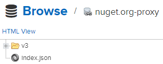
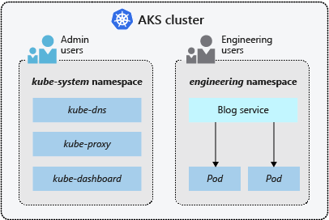

# nexus-k8s


A repository used for deploying Sonatype Nexus on Azure AKS cluster.

# Usage

* [Deploy Azure Storage Class](#deploy-azure-storage-class)
* [Deploy NGINX Ingress Controller](#deploy-nginx-ingress-controller)
* [Deploy cert-manager](#deploy-cert-manager)
* [Deploy Sonatype Nexus](#deploy-sonatype-nexus)
* [Configuring Nexus Repositories](#configuring-nexus-repositories)
    * [Docker Repositories](#docker-repositories)
        * [Hosted Docker Repository (Private Docker Registry)](#hosted-docker-repository-private-docker-registry)
        * [Docker Proxy Repository](#docker-proxy-repository)
        * [Grouping Docker Repositories](#grouping-docker-repositories)
    * [npm Repositories](#npm-repositories)
        * [Hosted npm Repository (Private npm Registry)](#hosted-npm-repository-private-npm-registry)
        * [npm Proxy Repository](#npm-proxy-repository)
        * [Grouping npm Repositories](#grouping-npm-repositories)
    * [NuGet Repositories](#nuget-repositories)
        * [Hosted NuGet Repository (Private Nuget Feed)](#hosted-nuget-repository-private-nuget-feed)
        * [NuGet Proxy Repository](#nuget-proxy-repository)
        * [Grouping NuGet Repositories](#grouping-nuget-repositories)
* [Network Policies](#network-policies)
    * [Deny All per Namespace](#deny-all-per-namespace)
        * [Deny All on default Namespace](#deny-all-on-default-namespace)
        * [Deny All on kube-system Namespace](#deny-all-on-default-namespace)
        * [Deny All on cert-manager Namespace](#deny-all-on-cert-manager-namespace)
        * [Deny All on nexus Namespace](#deny-all-on-nexus-namespace)
    * [kube-system Network Policy](#kube-system-network-policy)
        * [kube-dns Network Policy](#kube-dns-network-policy)
        * [metrics-server Network Policy](#metrics-server-network-policy)
        * [kube-proxy Network Policy](#kube-proxy-network-policy)
    * [Nexus Network Policy](#nexus-network-policy)
    * [Ingress Controller Network Policy](#ingress-controller-network-policy)

## Deploy Azure Storage Class

To define different tiers of storage, such as Premium and Standard, you can
create a **StorageClass**. The StorageClass also defines the reclaimPolicy.
This reclaimPolicy controls the behavior of the underlying Azure storage
resource when the pod is deleted and the persistent volume may no longer be
required. The underlying storage resource can be deleted, or retained for use
with a future pod.

In AKS, two initial StorageClasses are created:

* **default** - Uses Azure Standard storage to create a Managed Disk. The
  reclaim policy indicates that the underlying Azure Disk is deleted when the
  persistent volume that used it is deleted.
* **managed-premium** - Uses Azure Premium storage to create Managed Disk. The
  reclaim policy again indicates that the underlying Azure Disk is deleted when
  the persistent volume that used it is deleted.


If no StorageClass is specified for a persistent volume, the default
StorageClass is used. Take care when requesting persistent volumes so that they
use the appropriate storage you need. You can create a StorageClass for
additional needs using kubectl.

```
$ kubectl apply --filename='./storage-class.yml'
```

Verify that the storage class was provisioned with the correct attributes. We
are looking for the **ReclaimPolicy** attribute to be set to **Retain** and the
**AllowVolumeExpansion** attribute to be set to **True**.

```
$ kubectl describe storageclass managed-premium-retain

Name:            managed-premium-retain
IsDefaultClass:  No

Provisioner:           kubernetes.io/azure-disk
Parameters:            kind=Managed,storageaccounttype=Premium_LRS
AllowVolumeExpansion:  True
MountOptions:          <none>
ReclaimPolicy:         Retain
VolumeBindingMode:     Immediate
Events:                <none>
```

[Back to top](#usage)

## Deploy NGINX Ingress Controller

In Kubernetes, an **Ingress** is an object that allows access to your
Kubernetes services from outside the Kubernetes cluster. You configure access
by creating a collection of rules that define which inbound connections reach
which services.

This lets you consolidate your routing rules into a single resource. For
example, you might want to send requests to example.com/api/v1/ to an api-v1
service, and requests to example.com/api/v2/ to the api-v2 service. With an
Ingress, you can easily set this up without creating a bunch of LoadBalancers
or exposing each service on the Node.


Make sure you have the stable repo added to your Helm client.

```
$ helm repo add stable https://kubernetes-charts.storage.googleapis.com
$ helm repo update
```

Create a namespace to house the resources created by the nginx-ingress Helm
chart. In this tutorial I will be using **ingress controller per namespace**
and hence I will deploy it to the nexus namespace. The ingress controller will
be using a defined scope to watch for ingress on the nexus namespace only.

```
$ kubectl create namespace nexus
```

Deploy the nginx-ingress Helm chart. You can specify the version that you
desire to deploy. By specifying a version, you are able to track what version
of the chart you deployed. It is recommended to include a version when
deploying a Helm chart.

Linux:

```
$ helm install ingress-nexus stable/nginx-ingress \
    --namespace nexus \
    --values ./nginx-ingress/values.yml \
    --version 1.34.2
```

Windows (PowerShell):

```
PS> helm install ingress-nexus stable/nginx-ingress `
      --namespace nexus `
      --values .\nginx-ingress\values.yml `
      --version 1.34.2
```

Verify that the Ingress controller was deployed successfully. Note that the
service name includes the name of the chart deployed followed by
**-nginx-ingress-controller**. Replace the service name with the name of the
chart you used to deploy the Ingress controller.

Linux:

```
$ kubectl get service ingress-nexus-nginx-ingress-controller \
    --namespace nexus \
    --output=jsonpath="{.status.loadBalancer.ingress[0].ip}"
```

Windows (PowerShell):

```
PS> kubectl get service ingress-nexus-nginx-ingress-controller `
      --namespace nexus `
      --output=jsonpath="{.status.loadBalancer.ingress[0].ip}"
```

The command should of returned an IP address that was used to expose the
Ingress controller. Verify that you can hit the **default backend** of the
Ingress controller.

Linux:

```
$ curl --verbose ${IP_ADDRESS}/healthz
```

Windows (PowerShell):

```
PS> Invoke-WebRequest -Uri ${IP_ADDRESS}/healthz
```

You should have received a **HTTP 200** OK response code. On Linux, make sure
to use the verbose flag with curl (--verbose).

[Back to top](#usage)

## Deploy cert-manager

**cert-manager** is a Kubernetes addon to automate the management and issuance
of TLS certificates from various issuing sources. It will ensure certificates
are valid and up to date periodically, and attempt to renew certificates at an
appropriate time before expiry.

**Issuers**, and **ClusterIssuers**, are Kubernetes resources that represent
certificate authorities (CAs) that are able to generate signed certificates by
honoring certificate signing requests. All cert-manager certificates require a
referenced issuer that is in a ready condition to attempt to honor the request.

An Issuer is a namespaced resource, and it is not possible to issue
certificates from an Issuer in a different namespace. This means you will need
to create an Issuer in each namespace you wish to obtain Certificates in.

cert-manager has the concept of **Certificates** that define a desired x509
certificate which will be renewed and kept up to date. A Certificate is a
namespaced resource that references an **Issuer** or **ClusterIssuer** that
determine what will be honoring the certificate request.

When a Certificate is created, a corresponding **CertificateRequest** resource
is created by cert-manager containing the encoded x509 certificate request,
Issuer reference, and other options based upon the specification of the
Certificate resource.


Create a namespace to house the resources created by the cert-manager Helm
chart.

```
$ kubectl create namespace cert-manager
```

Install the CustomResourceDefinition resources separately.

Linux:

```
$ kubectl apply \
    --validate=false \
    --filename=https://github.com/jetstack/cert-manager/releases/download/v0.14.0/cert-manager.crds.yaml
```

Windows (PowerShell):

```
PS> kubectl apply `
      --validate=false `
      --filename=https://github.com/jetstack/cert-manager/releases/download/v0.14.0/cert-manager.crds.yaml
```

Add the jetstack Helm repository.

```
$ helm repo add jetstack https://charts.jetstack.io
$ helm repo update
```

Deploy the cert-manager Helm chart and issue your first certificate. You have
the choice of issuing a certificate managed by Let's Encrypt or a selfsigned
certificate. If you choose to issue a selfsigned certificate, make sure to
distribute the Certificate Authority (CA).

Make sure to update the values in **./cert-manager/nexus-selfsigning.yml**
to reflect the domain name that you are using. Change the  **commonName** and
**dnsNames** to reflect your domain name.

Linux:

```
$ helm install cert-manager jetstack/cert-manager \
    --namespace cert-manager \
    --values ./cert-manager/values.yml \
    --version v0.14.0

$ kubectl apply --filename='./cert-manager/nexus-selfsigning.yml'
```

Windows (PowerShell):

```
PS> helm install cert-manager jetstack/cert-manager `
      --namespace cert-manager `
      --values .\cert-manager\values.yml `
      --version v0.14.0

PS> kubectl apply --filename='.\cert-manager\nexus-selfsigning.yml'
```

Verify that the issuer and certificate were generated in the nexus
namespace. Make sure you wait for the certificate to be generated.

```
$ kubectl get issuer --namespace nexus

NAME                 READY   AGE
selfsigning-issuer   True    48s

$ kubectl get certificate --namespace nexus

NAME        READY   SECRET      AGE
nexus-tls   True    nexus-tls   62s
```

Fetch the selfsigned CA certificate and import it to the Trusted Root
Certification Authorities store. Refer to 
[How to manage Trusted Root Certificates in Windows 10](https://www.thewindowsclub.com/manage-trusted-root-certificates-windows)
to import the CA certificate in Windows 10.

Linux:

```
$ kubectl get secret nexus-tls \
    --namespace nexus \
    --output=jsonpath="{.data.ca\.crt}" \
    | base64 --decode
```

Windows (PowerShell):

```
PS> $certificate = kubectl get secret nexus-tls `
      --namespace nexus `
      --output=jsonpath="{.data.ca\.crt}"

PS> [System.Text.Encoding]::UTF8.GetString([System.Convert]::FromBase64String($certificate))
```

[Back to top](#usage)

## Deploy Sonatype Nexus

The proliferation of different **repository formats** and tools accessing them
as well as the emergence of more publicly available repositories has triggered
the need to manage access and usage of these repositories and the components
they contain.

In addition, hosting your own **private repositories** for internal components
has proven to be a very efficient methodology to exchange components during all
phases of the software development life cycle. It is considered a best
practice at this stage.

The task of managing all the repositories your development teams interact with
can be supported by the use of a dedicated server application - a 
**repository manager**.

Put simply, a repository manager provides two core features:

- the ability to proxy a remote repository and cache components saving both
  bandwidth and time required to retrieve a software component from a remote
  repository repeatedly
- the ability the host a repository providing an organization with a deployment
  target for internal software components


Add the oteemo Helm repository.

```
$ helm repo add oteemo https://oteemo.github.io/charts/
$ helm repo update
```

Apply the Pod Security Policy and RBAC role.

```
$ kubectl apply --filename='./nexus/nexus-psp.yml'
$ kubectl apply --filename='./nexus/nexus-role.yml'
```

Make sure you update the **host** value in **./nexus/values.yml**
to reflect the hostname that you are using for your Nexus instance.

Deploy the nexus Helm chart.

Linux:

```
$ helm install nexus oteemo/sonatype-nexus \
    --namespace nexus \
    --values ./nexus/values.yml \
    --version 1.26.0
```

Windows (PowerShell):

```
PS> helm install nexus oteemo/sonatype-nexus `
      --namespace nexus `
      --values .\nexus\values.yml `
      --version 1.27.1
```

Verify that the deployment was successful, make sure that the ingress has an
IP address allocated. You need to check that the **nexus-sonatype-nexus-** pod
is running.

```
$ kubectl get all --namespace nexus
$ kubectl get ingress --namespace nexus

NAME                   HOSTS            ADDRESS        PORTS     AGE
nexus-sonatype-nexus   nexus.ddns.net   192.168.65.3   80, 443   4m
```

[Back to top](#usage)

## Configuring Nexus Repositories

Repository managers are an essential part of any enterprise or open-source
software development effort, and they enable greater collaboration between
developers and wider distribution of software, by facilitating the exchange and
usage of binary components.

Put simply, a repository manager provides two core features:

- the ability to **proxy a remote repository** and cache components saving both
  bandwidth and time required to retrieve a software component from a remote
  repository repeatedly
- the ability to **host a repository** providing an organization with a deployment
  target for internal software components

[Back to top](#usage)

### Docker Repositories

Nexus Repository Manager Pro and Nexus Repository Manager OSS support Docker
registries as the Docker repository format for hosted and proxy repositories.
You can expose these repositories to the client-side tools directly or as a
repository group, which is a repository that merges and exposes the contents of
multiple repositories in one convenient URL. This allows you to reduce time and
bandwidth usage for accessing Docker images in a registry as well as share your
images within your organization in a hosted repository. Users can then launch
containers based on those images, resulting in a completely private Docker
registry with all the features available in the repository manager.

[Back to top](#usage)

#### Hosted Docker Repository (Private Docker Registry)

A hosted repository using the Docker repository format is typically called a
**private Docker registry**. It can be used to upload your own container images
as well as third-party images.

To create a Docker hosted repository, Click on the **gear icon** near the top
of the page. You will be redirected to the **Repository administration** page.
Navigate to the following page:

```
Repositories -> Create repository -> docker (hosted)
```


Make sure to specify **http port 5000** which will be the port exposed for the
hosted Docker repository. We will be using an ingress to route the traffic to
the **nexus-docker exposed service**. SSL will be terminated to the Nexus pod
on port 5000.


Click on the **Create repository** button near the end of the page to save the
changes. We are now ready to test our private Docker registry.

[Back to top](#usage)

##### Importing Selfsigned Certificate (Docker)

If you are using a selfsigned certificate, you will need to add the certificate
to the Docker client. This step can be skipped, if using Let's Encrypt or a
trusted CA.

Linux:

```
$ mkdir --parents /etc/docker/certs.d/nexus.blueskysilkart.com:5000
$ cp ~/certs/nexus.crt /etc/docker/certs.d/nexus.blueskysilkart.com:5000

$ sudo service docker restart
```

Windows (PowerShell):

```
PS> New-Item -path "${HOME}\.docker\certs.d\nexus.blueskysilkart.com5000" `
      -type directory

PS> Copy-Item "${HOME}\Downloads\nexus.crt" `
      -Destination "${HOME}\.docker\certs.d\nexus.blueskysilkart.com5000"

PS> $process = Get-Process "*docker desktop*"
PS> $process.Kill(); $process.WaitForExit()

PS> Start-Process "C:\Program Files\Docker\Docker\Docker Desktop.exe"
```

In order to be able to push and pull images from the hosted Docker repository,
you will need to authenticate to the repository.

```
$ docker login nexus.blueskysilkart.com
Login Succeeded
```

Once you are logged in, you can test the repository by building and pushing an
image to the private registry. I have provided a demo **Dockerfile** under the
**test** directory.

Build the test image.

```
$ cd test
$ docker build --tag nexus.blueskysilkart.com/curl .
```

Push the image to the hosted Docker repository.

```
$ docker push nexus.blueskysilkart.com/curl

The push refers to repository [nexus.blueskysilkart.com/curl]
c596221d6f3a: Pushed
beee9f30bc1f: Pushed
latest: digest: sha256:e27b40bdce52ebac0d49be84dad7f07b46c44a4f0ef96821af9cdcb14a8c962a size: 739
```

Congratulations you have pushed your first image!


You can verify that the image was pushed by browsing the repository through the
Nexus UI.


[Back to top](#usage)

#### Docker Proxy Repository

**Docker Hub** is the common registry used by all image creators and consumers.
To reduce duplicate downloads and improve download speeds for your developers
and CI servers, you should proxy Docker Hub and any other registry you use for
Docker images.

To create a Docker proxy repository, Click on the **gear icon** near the top
of the page. You will be redirected to the **Repository administration** page.
Navigate to the following page:

```
Repositories -> Create repository -> docker (proxy)
```


Make sure you do not specify a port. The Docker proxy will be exposed by using
the Docker group repository. You will need to specify the URL of the remote
Docker registry being proxied. Also make sure to select the **Use Docker Hub**
radio button under **Docker Index**. If you are using a different registry, you
can select Use proxy registry (specified above) or Custom Index.


Click on the **Create repository** button near the end of the page to save the
changes.

If you are using a selfsigned certificate, you will need to add the certificate
to the Docker client. In our case, we are using a **wildcard selfsigned
certificate**. Refer to
[Importing Selfsigned Certificate (Docker)](#importing-selfsigned-certificate-docker)
for instructions on how to add a selfsigned certificate to the Docker client,
if needed.

Here is a preview of what the Docker proxy repository will look like.


In order to be able to test the Docker proxy, we will need to go the next
section to setup a Docker group repository.

[Back to top](#usage)

#### Grouping Docker Repositories

A repository group is the recommended way to expose all your repositories for
read access to your users. It allows you to pull images from all repositories
in the group without needing any further client side configuration after the
initial setup. A repository group allows you to expose the aggregated content
of multiple proxy and hosted repositories with one URL to your tools.

Before we create a **Docker group repository**, we will need to expose port
5001 through a service.

```
$ kubectl apply --filename='./nexus/docker-proxy-svc.yml'
```

To create a Docker group repository Click on the **gear icon** near the top
of the page. You will be redirected to the **Repository administration** page.
Navigate to the following page:

```
Repositories -> Create repository -> docker (group)
```


Make sure to specify **http port 5001** which will be the port exposed for the
Docker group repository. We will be using an ingress to route the traffic to
the **nexus-docker-proxy exposed service**. SSL will be terminated to the Nexus
pod on port 5001.

Add the members to the group, **docker-hub** proxy and **docker hosted**
repository.


Click on the **Create repository** button near the end of the page to save the
changes. We are now ready to test our Docker group repository.

If you are using a selfsigned certificate, you will need to add the certificate
to the Docker client. In our case, we are using a **wildcard selfsigned
certificate**.
Refer to [Importing Selfsigned Certificate (Docker)](#importing-selfsigned-certificate-docker)
for instructions on how to add a selfsigned certificate to the Docker client,
if needed.

In order to be able to pull images from the Docker group repository, you will
need to authenticate to the repository.

```
$ docker login docker-proxy.nexus.blueskysilkart.com
Login Succeeded
```

Once you are logged in, you can test the repository by pulling imgaes from the
Docker group.

Pull alpine image from Docker Hub using the Docker group repository.

```
$ docker pull docker-proxy.nexus.blueskysilkart.com/alpine
```

Pull an existing image from the Docker hosted repository using the Docker group
repository.

```
$ docker pull docker-proxy.nexus.blueskysilkart.com/curl

$ docker images --filter=reference='*/*curl'
REPOSITORY                                   TAG                 IMAGE ID            CREATED             SIZE
docker-proxy.nexus.blueskysilkart.com/curl   latest              e91e50549180        9 minutes ago       8.52MB
nexus.blueskysilkart.com/curl                latest              e91e50549180        9 minutes ago       8.52MB
```

As you can see everything is working, you should be able to pull images from
the Docker group. You can use the Docker group as a proxy to fetch and cache
images. You should have noticed that there are two curl images with the same
**IMAGE ID**. One of the image was fetched by using the Docker hosted
repository and other through the Docker group repository.

You can verify that the image was cached by browsing the repository through the
Nexus UI.


[Back to top](#usage)

### npm Repositories

The command line tool npm is a package management solution for Javascript-based
development. It is used to create and use node packaged modules and is built
into the Javascript platform Node.js.

NXRM supports the npm registry format for proxy repositories. This allows you
to take advantage of the packages in the npm registry and other public
registries without incurring repeated downloads of packages, since they will be
proxied in the repository manager.

In addition, Nexus Repository Manager supports running your own private
registry, also known as a hosted repository, using the npm format. You can
share internally developed, proprietary packages within your organization via
these private registries allowing you to collaborate efficiently across
development teams with a central package exchange and storage location.

[Back to top](#usage)

#### Hosted npm Repository (Private npm Registry)

A private npm registry can be used to upload your own packages as well as
third-party packages. You can create a private npm registry by setting up a
hosted repository with the npm format in the repository manager.

To create a npm hosted repository, Click on the **gear icon** near the top
of the page. You will be redirected to the **Repository administration** page.
Navigate to the following page:

```
Repositories -> Create repository -> npm (hosted)
```


Click on the **Create repository** button near the end of the page to save the
changes.

##### Importing Selfsigned Certificate (npm)

If you are using a selfsigned certificate, you will need to add the certificate
to npm. This step can be skipped, if using Let's Encrypt or a trusted CA.

Linux:

```
$ npm config set cafile /home/massimo/certs/nexus.crt --global
```

Windows (PowerShell):

```
PS> npm config set cafile C:\Users\mcanna01\certs\nexus.crt --global
```

In order to be able to push and pull npm packages from the hosted npm
repository, you will need to authenticate to the repository.

[Back to top](#usage)

##### Enable npm Bearer Token Realm

Enable the **npm Bearer Token Realm** to allow authentication through
**npm adduser**.

Navigate to the **Realms** configuration page.


Make sure you select **npm Bearer Token Realm**. Click on the **Save** button
near the end of the page to save the changes.

Authenicate to the repository.

```
$ npm adduser --registry https://nexus.blueskysilkart.com/repository/npm/
Logged in as massimo on https://nexus.blueskysilkart.com/repository/npm/.
```

Once you are logged in, you can test the repository by building and pushing a
package to the private npm registry. I have provided a demo **package.json**
file under the **test** directory.

Publish the test npm package.

```
$ cd test

$ npm publish --registry https://nexus.blueskysilkart.com/repository/npm/
npm notice
npm notice package: test@1.0.0
npm notice === Tarball Contents ===
npm notice 320B package.json
npm notice === Tarball Details ===
npm notice name:          test
npm notice version:       1.0.0
npm notice package size:  304 B
npm notice unpacked size: 320 B
npm notice shasum:        836ab4aa73a335a042764c990743afc060212524
npm notice integrity:     sha512-fjoUV/MoG9296[...]TDhx0jIYiK5KQ==
npm notice total files:   1
npm notice
+ test@1.0.0
```

You can verify that the package was pushed by browsing the repository through
the Nexus UI.


[Back to top](#usage)

#### npm Proxy Repository

To reduce duplicate downloads and improve download speeds for your developers
and CI servers, you should proxy the registry served at
https://registry.npmjs.org. By default npm accesses this registry directly. You
can also proxy any other registries you require.

To create a npm proxy repository, Click on the **gear icon** near the top
of the page. You will be redirected to the **Repository administration** page.
Navigate to the following page:

```
Repositories -> Create repository -> npm (proxy)
```


Click on the **Create repository** button near the end of the page to save the
changes.

If you are using a selfsigned certificate, you will need to add the certificate
to npm. This step can be skipped, if using Let's Encrypt or a trusted CA.
Refer to [Importing Selfsigned Certificate (npm)](#importing-selfsigned-certificate-npm)
for instructions on how to add a selfsigned certificate to npm, if needed.

In order to be able to pull npm packages from the npm proxy repository, you
will need to authenticate to the repository.

Refer to [Enable npm Bearer Token Realm](enable-npm-bearer-token-realm) on how
to enable authentication through **npm adduser**.

Authenicate to the repository.

```
$ npm adduser --registry https://nexus.blueskysilkart.com/repository/npm-registry/
Logged in as massimo on https://nexus.blueskysilkart.com/repository/npm-registry/.
```

Once you are logged in, you can test the repository by pulling a package from
the npm proxy repository.

```
$ npm --registry https://nexus.blueskysilkart.com/repository/npm-registry/ install react
```

You can verify that the package was cached by browsing the repository through
the Nexus UI.


[Back to top](#usage)

#### Grouping npm Repositories

A repository group is the recommended way to expose all your npm registries
repositories from the repository manager to your users, with miminal client
side configuration. A repository group allows you to expose the aggregated
content of multiple proxy and hosted repositories with one URL to npm and other
tools.

To create a npm group repository, Click on the **gear icon** near the top
of the page. You will be redirected to the **Repository administration** page.
Navigate to the following page:

```
Repositories -> Create repository -> npm (group)
```


Add the members to the group, **npm-registry** proxy and **npm hosted**
repository.


Click on the **Create repository** button near the end of the page to save the
changes. We are now ready to test our npm group repository.

If you are using a selfsigned certificate, you will need to add the certificate
to npm. This step can be skipped, if using Let's Encrypt or a trusted CA.
Refer to [Importing Selfsigned Certificate (npm)](#importing-selfsigned-certificate-npm)
for instructions on how to add a selfsigned certificate to npm, if needed.

In order to be able to pull npm packages from the npm proxy repository, you
will need to authenticate to the repository.

Refer to [Enable npm Bearer Token Realm](enable-npm-bearer-token-realm) on how
to enable authentication through **npm adduser**.

Authenicate to the repository.

```
$ npm adduser --registry https://nexus.blueskysilkart.com/repository/npm-group/
Logged in as massimo on https://nexus.blueskysilkart.com/repository/npm-group/.
```

Once you are logged in, you can test the repository by pulling a package from
the npm group repository.

```
$ npm --registry https://nexus.blueskysilkart.com/repository/npm-group/ install test@1.0.0
```

You can verify that the package was cached by browsing the repository through
the Nexus UI.


[Back to top](#usage)

### NuGet Repositories

With the creation of the NuGet project, a package management solution for .NET
developers has become available. Similar to Apache Maven dependency management
for Java developers, NuGet makes it easy to add, remove and update libraries
and tools in Visual Studio projects that use the .NET Framework.

Nexus Repository Manager and NuGet allow you to improve collaboration and
control, while speeding up .NET development, by facilitating open source
libraries and sharing of internal component across teams. When you standardize
on a single repository for all your development and use it for internal
components, as well, you will get all the benefits of using a repository
manager when working in the .NET architecture.

[Back to top](#usage)

#### Hosted NuGet Repository (Private Nuget Feed)

A hosted repository for NuGet can be used to upload your own packages as well
as third-party packages. The repository manager includes a hosted NuGet
repository named nuget-hosted by default.

To create another NuGet hosted repository, Click on the **gear icon** near the
top of the page. You will be redirected to the **Repository administration**
page. Navigate to the following page:

```
Repositories -> Create repository -> nuget (hosted)
```


Click on the **Create repository** button near the end of the page to save the
changes. We are now ready to test our NuGet hosted repository.

If you are using a selfsigned certificate, you will need to add the certificate
to the Windows certificate store. Refer to 
[How to manage Trusted Root Certificates in Windows 10](https://www.thewindowsclub.com/manage-trusted-root-certificates-windows)
to import the CA certificate in Windows 10.

In order to be able to push and pull NuGet packages from the hosted NuGet
repository, you will need to authenticate to the repository.

[Back to top](#usage)

##### Fetch NuGet API Key

You can access your NuGet API key by pressing on the Access API Key button and
providing password. Click on your username and select **NuGet API Key** on the
left navigation menu.

The resulting user interface context is displayed:


Authenicate to the repository.

```
PS> nuget setapikey 80bdcb42-fd8a-307f-a313-360af173ebfe -source https://nexus.blueskysilkart.com/repository/nuget/
The API Key '80bdcb42-fd8a-307f-a313-360af173ebfe' was saved for 'https://nexus.blueskysilkart.com/repository/nuget/'.
```

I have provided a demo **Package.nuspec** file under the **test** directory.
You can use this file to build a demo package and push it to the NuGet hosted
repository.

Build the empty demo NuGet package.

```
PS> nuget pack .\Package.nuspec
```

Push the demo NuGet package to the repository.

```
PS> nuget push Package.1.0.0.nupkg -Source https://nexus.blueskysilkart.com/repository/nuget/
Pushing Package.1.0.0.nupkg to 'https://nexus.blueskysilkart.com/repository/nuget/'...
  PUT https://nexus.blueskysilkart.com/repository/nuget/
  Created https://nexus.blueskysilkart.com/repository/nuget/ 482ms
Your package was pushed.
```

You can verify that the package was pushed by browsing the repository through
the Nexus UI.


[Back to top](#usage)

#### NuGet Proxy Repository

The NuGet Gallery is the common repository used by all package authors and
consumers. To reduce duplicate downloads and improve download speeds for your
developers and CI servers, you should proxy the NuGet Gallery with the
repository manager. If you use other external repositories, you should also
proxy these. A default installation of the repository manager has the NuGet
gallery set up as a proxy repository with the name nuget.org-proxy.

If you are using a selfsigned certificate, you will need to add the certificate
to the Windows certificate store. Refer to 
[How to manage Trusted Root Certificates in Windows 10](https://www.thewindowsclub.com/manage-trusted-root-certificates-windows)
to import the CA certificate in Windows 10.

You can test the repository by pulling a package from the NuGet proxy
repository.

```
PS> nuget install newtonsoft.json -Source https://nexus.blueskysilkart.com/repository/nuget.org-proxy/index.json
Feeds used:
  https://nexus.blueskysilkart.com/repository/nuget.org-proxy/index.json

Installing package 'newtonsoft.json' to 'C:\Users\mcanna01\Desktop\test'.
  CACHE https://nexus.blueskysilkart.com/repository/nuget.org-proxy/v3/registration/5/newtonsoft.json/index.json


Attempting to gather dependency information for package 'newtonsoft.json.12.0.3' with respect to project 'C:\Users\mcanna01\Desktop\test', targeting 'Any,Version=v0.0'
Gathering dependency information took 35.34 ms
Attempting to resolve dependencies for package 'newtonsoft.json.12.0.3' with DependencyBehavior 'Lowest'
Resolving dependency information took 0 ms
Resolving actions to install package 'newtonsoft.json.12.0.3'
Resolved actions to install package 'newtonsoft.json.12.0.3'
Retrieving package 'Newtonsoft.Json 12.0.3' from 'https://nexus.blueskysilkart.com/repository/nuget.org-proxy/index.json'.
Adding package 'Newtonsoft.Json.12.0.3' to folder 'C:\Users\mcanna01\Desktop\test'
Added package 'Newtonsoft.Json.12.0.3' to folder 'C:\Users\mcanna01\Desktop\test'
Successfully installed 'Newtonsoft.Json 12.0.3' to C:\Users\mcanna01\Desktop\test
Executing nuget actions took 261.68 ms
```

You can verify that the package was cached by browsing the repository through
the Nexus UI.



[Back to top](#usage)

#### Grouping NuGet Repositories

A repository group is the recommended way to expose all your NuGet repositories
from the repository manager to your users, without needing any further client
side configuration. A repository group allows you to expose the aggregated
content of multiple proxy and hosted repositories with one URL to your tools.

Nexus Repository Manager includes a nuget-group repository group. This default
groups the nuget.org-proxy repository that proxies the NuGet Gallery and the
nuget-hosted hosted repository. You can add additional hosted and proxy
repositories to it, once you have set them up.

If you are using a selfsigned certificate, you will need to add the certificate
to the Windows certificate store. Refer to 
[How to manage Trusted Root Certificates in Windows 10](https://www.thewindowsclub.com/manage-trusted-root-certificates-windows)
to import the CA certificate in Windows 10.

In order to be able to pull NuGet packages from the NuGet group repository, you
will need to authenticate to the repository. Refer to 
[Fetch NuGet API Key](#fetch-nuget-api-key) on how to fetch the API
key that is used to authenticate with the NuGet group repository.

Authenicate to the repository.

```
PS> nuget setapikey 80bdcb42-fd8a-307f-a313-360af173ebfe -source https://nexus.blueskysilkart.com/repository/nuget-group/
The API Key '80bdcb42-fd8a-307f-a313-360af173ebfe' was saved for 'https://nexus.blueskysilkart.com/repository/nuget-group/'.
```

You can test the repository by pulling a package from the NuGet group
repository. Note that you must use https://www.nuget.org/api/v2/ as the remote
repository for the NuGet proxy. There is a weird bug where v3 API does not work
when using a NuGet group repository.

```
PS> nuget install Package -Version 1.0.0 -Source https://nexus.blueskysilkart.com/repository/nuget-group
Feeds used:
  C:\Users\mcanna01\.nuget\packages\
  https://nexus.blueskysilkart.com/repository/nuget-group


Attempting to gather dependency information for package 'Package.1.0.0' with respect to project 'C:\Users\mcanna01\Desktop\test', targeting 'Any,Version=v0.0'
Gathering dependency information took 479.31 ms
Attempting to resolve dependencies for package 'Package.1.0.0' with DependencyBehavior 'Lowest'
Resolving dependency information took 0 ms
Resolving actions to install package 'Package.1.0.0'
Resolved actions to install package 'Package.1.0.0'
Retrieving package 'Package 1.0.0' from 'C:\Users\mcanna01\.nuget\packages\'.
Adding package 'Package.1.0.0' to folder 'C:\Users\mcanna01\Desktop\test'
Added package 'Package.1.0.0' to folder 'C:\Users\mcanna01\Desktop\test'
Successfully installed 'Package 1.0.0' to C:\Users\mcanna01\Desktop\test
Executing nuget actions took 239.15 ms
```

You can verify that the package was cached by browsing the repository through
the Nexus UI.


[Back to top](#usage)

## Network Policies

When you run modern, microservices-based applications in Kubernetes, you often
want to control which components can communicate with each other. The principle
of least privilege should be applied to how traffic can flow between pods in an
Azure Kubernetes Service (AKS) cluster. Let's say you likely want to block
traffic directly to back-end applications. The Network Policy feature in
Kubernetes lets you define rules for ingress and egress traffic between pods in
a cluster.

All pods in an AKS cluster can send and receive traffic without limitations, by
default. To improve security, you can define rules that control the flow of
traffic. Back-end applications are often only exposed to required front-end
services, for example. Network policies do not conflict, they are additive. If
any policy or policies select a pod, the pod is restricted to what is allowed
by the union of those policies ingress/egress rules. Thus, order of evaluation
does not affect the policy result.

Azure provides two ways to implement network policy. You choose a network
policy option when you create an AKS cluster. The policy option can't be
changed after the cluster is created:

- Azure's own implementation, called Azure Network Policies.
- Calico Network Policies, an open-source network and network security
  solution founded by Tigera.

Both implementations use Linux IPTables to enforce the specified policies.
Policies are translated into sets of allowed and disallowed IP pairs. These
pairs are then programmed as IPTable filter rules.

To use Azure Network Policy, you must use the Azure CNI plug-in and define your
own virtual network and subnets.


[Back to top](#usage)

### Deny All per Namespace

It is recommended to block all network traffic by default. In order to
accomplish this, you need to define a network policy per namespace that blocks
all ingress traffic. We can begin by denying all traffic on the default and
kube-system namespace.

##### Determine CIDR Used by the Cluster

Before deploying the **deny-all.yml** network policy, you will need to
determine the **cluster CIDR range**.

```
$ kubectl cluster-info dump | grep "cluster-cidr"
```

Windows (PowerShell):

```
PS> kubectl cluster-info dump | Select-String "cluster-cidr"
```

Make sure to update the **cidr** under **ipBlock** with the
**cluster CIDR range** of your cluster.

Deploy the deny-all network policy on the default namespace.

```
$ kubectl apply --filename='./deny-all-netpol.yml'
```

There are five network policies that are deployed from the
**deny-all-netpol.yml** file. In this section we will focus on the two deny-all
network polcies. The first policy will deny all non-whitelisted traffic on the
**default** namespace. The second policy will deny all non-whitelisted traffic
on the **kube-system** namespace.

[Back to top](#usage)

#### Deny All on default Namespace

Verify that the deny-all network policy was deployed in the **default**
namespace.

```
$ kubectl describe netpol deny-all

Name:         deny-all
Namespace:    default
Created on:   2020-04-23 10:57:44 -0700 MST
Labels:       <none>
Annotations:  kubectl.kubernetes.io/last-applied-configuration:
                {"apiVersion":"networking.k8s.io/v1","kind":"NetworkPolicy","metadata":{"annotations":{},"name":"deny-all","namespace":"default"},"spec":{...
Spec:
  PodSelector:     <none> (Allowing the specific traffic to all pods in this namespace)
  Allowing ingress traffic:
    <none> (Selected pods are isolated for ingress connectivity)
  Not affecting egress traffic
  Policy Types: Ingress
```

The **deny-all network policy** denies all non-whitelisted ingress traffic on
the default namespace. This will prevent exposing pods on the default
namespace.

Verify that the deny-all network policy is blocking all traffic by default.

Linux:

```
$ kubectl run backend \
    --image=nginx \
    --labels app=webapp,role=backend \
    --expose \
    --port 80 \
    --generator=run-pod/v1

$ kubectl run \
    --rm -it \
    --image=alpine network-policy \
    --generator=run-pod/v1

/ # wget -qO- --timeout=2 http://backend
wget: download timed out
```

Windows (PowerShell):

```
PS> kubectl run backend `
      --image=nginx `
      --labels app=webapp,role=backend `
      --expose `
      --port 80 `
      --generator=run-pod/v1

PS> kubectl run `
      --rm -it `
      --image=alpine network-policy `
      --generator=run-pod/v1

/ # wget -qO- --timeout=2 http://backend
wget: download timed out
```

The wget command on the pod should eventually timeout when trying to
communicate with another pod on the same namespace. Don't forget to clean up
the default namespace, after testing the network policy.

[Back to top](#usage)

#### Deny All on kube-system Namespace

Verify that the deny-all network policy was deployed in the **kube-system**
namespace.

```
$ kubectl describe netpol deny-all --namespace kube-system

Name:         deny-all
Namespace:    kube-system
Created on:   2020-04-23 10:57:44 -0700 MST
Labels:       <none>
Annotations:  kubectl.kubernetes.io/last-applied-configuration:
                {"apiVersion":"networking.k8s.io/v1","kind":"NetworkPolicy","metadata":{"annotations":{},"name":"deny-all","namespace":"kube-system"},"spe...
Spec:
  PodSelector:     <none> (Allowing the specific traffic to all pods in this namespace)
  Allowing ingress traffic:
    <none> (Selected pods are isolated for ingress connectivity)
  Not affecting egress traffic
  Policy Types: Ingress
```

This policy is similar to the deny-all network policy in the default namespace.
All non-whitelisted ingress traffic is denied on the **kube-system** namespace.

[Back to top](#usage)

#### Deny All on cert-manager Namespace

Deploy the deny-all network policy on the cert-manager namespace.

```
$ kubectl apply --filename='./cert-manager/deny-all-netpol.yml'
```

Verify that the deny-all network policy was deployed in the **cert-manager**
namespace.

```
$ kubectl describe netpol deny-all --namespace cert-manager

Name:         deny-all
Namespace:    cert-manager
Created on:   2020-04-23 14:26:55 -0700 MST
Labels:       <none>
Annotations:  kubectl.kubernetes.io/last-applied-configuration:
                {"apiVersion":"networking.k8s.io/v1","kind":"NetworkPolicy","metadata":{"annotations":{},"name":"deny-all","namespace":"cert-manager"},"sp...
Spec:
  PodSelector:     <none> (Allowing the specific traffic to all pods in this namespace)
  Allowing ingress traffic:
    <none> (Selected pods are isolated for ingress connectivity)
  Not affecting egress traffic
  Policy Types: Ingress
```

This policy is similar to the deny-all network policy in the default namespace.
All non-whitelisted ingress traffic is denied on the **cert-manager** namespace.

[Back to top](#usage)

#### Deny All on nexus Namespace

This policy is part of the **nexus network policy**, refer to
[Nexus Network Policy](#nexus-network-policy) for deploying the policy.

Verify that the deny-all network policy was deployed in the **nexus**
namespace.

```
$ kubectl describe netpol deny-all --namespace nexus

Name:         deny-all
Namespace:    nexus
Created on:   2020-04-16 15:18:12 -0700 MST
Labels:       <none>
Annotations:  kubectl.kubernetes.io/last-applied-configuration:
                {"apiVersion":"networking.k8s.io/v1","kind":"NetworkPolicy","metadata":{"annotations":{},"name":"deny-all","namespace":"nexus"},"spec":{"i...
Spec:
  PodSelector:     <none> (Allowing the specific traffic to all pods in this namespace)
  Allowing ingress traffic:
    <none> (Selected pods are isolated for ingress connectivity)
  Not affecting egress traffic
  Policy Types: Ingress
```

This policy is similar to the deny-all network policy in the default namespace.
All non-whitelisted ingress traffic is denied on the **nexus** namespace.

[Back to top](#usage)

### kube-system Network Policy

The **kube-system** namespace is used for Kubernetes components managed by
Kubernetes. As a general rule, avoid adding normal workloads to this namespace.
It is intended to be managed directly by the system and contains pods such as:
**kube-dns** (CoreDNS) and **kube-proxy**.



The **kube-system** network policy consists of three different network policies:
kube-dns, metrics-server, and kube-proxy.

[Back to top](#usage)

#### kube-dns Network Policy

Verify that the **kube-dns network policy** was deployed.

```
$ kubectl describe netpol kube-dns --namespace kube-system

Name:         kube-dns
Namespace:    kube-system
Created on:   2020-04-23 10:57:44 -0700 MST
Labels:       <none>
Annotations:  kubectl.kubernetes.io/last-applied-configuration:
                {"apiVersion":"networking.k8s.io/v1","kind":"NetworkPolicy","metadata":{"annotations":{},"name":"kube-dns","namespace":"kube-system"},"spe...
Spec:
  PodSelector:     k8s-app=kube-dns
  Allowing ingress traffic:
    To Port: 53/TCP
    To Port: 53/UDP
    From:
      IPBlock:
        CIDR: 10.240.0.0/16
        Except:
  Not affecting egress traffic
  Policy Types: Ingress
```

Make sure to update the **cidr** under **ipBlock** with the
**cluster CIDR range** of your cluster. Refer to
[Determine CIDR Used by the Cluster](#determine-cidr-used-by-the-cluster) to
fetch the CIDR range being used by the cluster.

The **kube-dns network policy** allows a specific range of IP addresses to
communicate with the kube-dns (CoreDNS) pod. The CIDR range used should be the
range of IP addresses allocated in your cluster. This policy allows only
traffic that is within the local network of the cluster. DNS requires both TCP
and UDP traffic on port 53. If this port is not allowed, the internal
Kubernetes DNS will fail to resolve pods in the cluster.

**CoreDNS** is a fast and flexible DNS server. The key word here is flexible:
with CoreDNS you are able to do what you want with your DNS data by utilizing
plugins. If some functionality is not provided out of the box you can add it by
writing a plugin.

**Azure Kubernetes Service (AKS)** uses the **CoreDNS project** for cluster DNS
management and resolution with all 1.12.x and higher clusters. Previously, the
**kube-dns** project was used.


[Back to top](#usage)

#### metrics-server Network Policy

Verify that the **metrics-server network policy** was deployed.

```
$ kubectl describe netpol metrics-server --namespace kube-system

Name:         metrics-server
Namespace:    kube-system
Created on:   2020-04-23 15:19:53 -0700 MST
Labels:       <none>
Annotations:  kubectl.kubernetes.io/last-applied-configuration:
                {"apiVersion":"networking.k8s.io/v1","kind":"NetworkPolicy","metadata":{"annotations":{},"name":"metrics-server","namespace":"kube-system"...
Spec:
  PodSelector:     k8s-app=metrics-server
  Allowing ingress traffic:
    To Port: 443/TCP
    From:
      IPBlock:
        CIDR: 10.240.0.0/16
        Except:
  Not affecting egress traffic
  Policy Types: Ingress
```

Make sure to update the **cidr** under **ipBlock** with the
**cluster CIDR range** of your cluster. Refer to
[Determine CIDR Used by the Cluster](#determine-cidr-used-by-the-cluster) to
fetch the CIDR range being used by the cluster.

The **metrics-server network policy** allows a specific range of IP addresses
to communicate with the metrics-server pod. The CIDR range used should be the
range of IP addresses allocated in your cluster. This policy allows only
traffic that is within the local network of the cluster. Port 443 is used by
the metrics-server to server the metrics data collected. If this port is not
allowed, the ```kubectl top``` command will fail to fetch metrics on the nodes.

Metrics Server is a scalable, efficient source of container resource metrics for
Kubernetes built-in autoscaling pipelines. Metrics Server collects resource
metrics from Kubelets and exposes them in **Kubernetes apiserver** through
Metrics API for use by Horizontal Pod Autoscaler and Vertical Pod Autoscaler.
Metrics API can also be accessed by **kubectl top**, making it easier to debug
autoscaling pipelines.

Metrics Server has specific requirements for cluster and network configuration.
These requirements aren't the default for all cluster distributions. Please
ensure that your cluster distribution supports these requirements before using
Metrics Server:

- Metrics Server must be reachable from kube-apiserver
- The kube-apiserver must be correctly configured to enable an aggregation
  layer
- Nodes must have kubelet authorization configured to match Metrics Server
  configuration
- Container runtime must implement a container metrics RPCs


[Back to top](#usage)

#### kube-proxy Network Policy

Verify that the **kube-proxy network policy** was deployed.

```
$ kubectl describe netpol kube-proxy --namespace kube-system

Name:         kube-proxy
Namespace:    kube-system
Created on:   2020-04-23 12:05:09 -0700 MST
Labels:       <none>
Annotations:  kubectl.kubernetes.io/last-applied-configuration:
                {"apiVersion":"networking.k8s.io/v1","kind":"NetworkPolicy","metadata":{"annotations":{},"name":"kube-proxy","namespace":"kube-system"},"s...
Spec:
  PodSelector:     component=kube-proxy
  Allowing ingress traffic:
    To Port: 10250/TCP
    To Port: 10256/TCP
    From:
      IPBlock:
        CIDR: 10.240.0.0/16
        Except:
  Not affecting egress traffic
  Policy Types: Ingress
```

Make sure to update the **cidr** under **ipBlock** with the
**cluster CIDR range** of your cluster. Refer to
[Determine CIDR Used by the Cluster](#determine-cidr-used-by-the-cluster) to
fetch the CIDR range being used by the cluster.

The **kube-proxy network policy** allows a specific range of IP addresses
to communicate with the kube-proxy pod. The CIDR range used should be the
range of IP addresses allocated in your cluster. This policy allows only
traffic that is within the local network of the cluster. Port 10250 is used
as an API to allow full node access. If this port is not allowed, you will not
be able to provision pods on the cluster. Port 10256 is used as a health check
server for kube-proxy.

Each node has a **kube-proxy** container process. (In the Kubernetes frame of
reference, that kube-proxy container is in a pod in the kube-system namespace.)
kube-proxy manages forwarding of traffic addressed to the virtual IP addresses
of the clusters Kubernetes Service objects to the appropriate backend
pods. kube-proxy currently supports three different operation modes:

- User space: This mode gets its name because the service routing takes place
  in kube-proxy in the user process space instead of in the kernel network
  stack. It is not commonly used as it is slow and outdated.
- iptables: This mode uses Linux kernel-level Netfilter rules to configure all
  routing for Kubernetes Services. This mode is the default for kube-proxy on
  most platforms. When load balancing for multiple backend pods, it uses
  unweighted round-robin scheduling.
- IPVS (IP Virtual Server): Built on the Netfilter framework, IPVS implements
  Layer-4 load balancing in the Linux kernel, supporting multiple
  load-balancing algorithms, including least connections and shortest expected
  delay. This kube-proxy mode became generally available in Kubernetes 1.11,
  but it requires the Linux kernel to have the IPVS modules loaded. It is also
  not as widely supported by various Kubernetes networking projects as the
  iptables mode.


[Back to top](#usage)

### Nexus Network Policy

If you are developing software without a **repository manager** you are likely
missing a number of opportunities to reduce some pretty obvious inefficiencies.
If everyone on your team has to hit public repositories like the Central
Repository to download components, you are missing out on some simple gains in
speed and efficiency. If you don't have a local place to deploy components you
are forced to share binary components using half-measures and compromises such
as storing binaries in source control.

Deploy the nexus network policy.

```
$ kubectl apply --filename='./nexus/nexus-netpol.yml'
```

Verify that the **nexus network policy** was deployed.

```
$ kubectl describe netpol nexus --namespace nexus

Name:         nexus
Namespace:    nexus
Created on:   2020-04-16 15:18:12 -0700 MST
Labels:       <none>
Annotations:  kubectl.kubernetes.io/last-applied-configuration:
                {"apiVersion":"networking.k8s.io/v1","kind":"NetworkPolicy","metadata":{"annotations":{},"name":"nexus","namespace":"nexus"},"spec":{"ingr...
Spec:
  PodSelector:     app=sonatype-nexus
  Allowing ingress traffic:
    To Port: 8081/TCP
    To Port: 5000/TCP
    To Port: 5001/TCP
    From:
      NamespaceSelector: name=nexus
      PodSelector: app=nginx-ingress,app.kubernetes.io/component=controller
  Not affecting egress traffic
  Policy Types: Ingress
```

The **nexus network policy** allows specific traffic to the nexus pod on the
nexus namespace. The Ingress controller pod is only allowed to redirect traffic
to port 8081, 5000, and 5001 on the nexus pod. Port 8081 is used by nexus to
serve the frontend application UI. Port 5000 is used by the private Docker
registry being hosted inside of nexus. Port 5001 is used by the Docker
group repository inside of nexus to proxy numerous Docker registries.


[Back to top](#usage)

### Ingress Controller Network Policy

Kubernetes Ingresses offer you a flexible way of routing traffic from beyond
your cluster to internal Kubernetes Services. Ingress Resources are objects in
Kubernetes that define rules for routing HTTP and HTTPS traffic to Services.
For these to work, an Ingress Controller must be present; its role is to
implement the rules by accepting traffic (most likely via a Load Balancer) and
routing it to the appropriate Services. Most Ingress Controllers use only one
global Load Balancer for all Ingresses, which is more efficient than creating a
Load Balancer per every Service you wish to expose.


By default the deny-all policy that was deployed on the nexus namespace will
block all incoming traffic. This means that when you try to hit the Ingress
Controller from outside, the traffic will be denied. To fix this issue you will
need to **whitelist** either a range of IP addresses or a single IP address
such as your office network IP.

Make sure to update the **cidr** under **ipBlock** in 
**nginx-ingress/ingress-controller-netpol.yml** file. For example you could add
a single IP address **x.x.x.x/32**.

Deploy the nginx-ingress network policy.

```
$ kubectl apply --filename='./nginx-ingress/ingress-controller-netpol.yml'
```

Verify that the **nginx-ingress network policy** was deployed.

```
$ kubectl describe netpol nginx-ingress --namespace nexus

Name:         nginx-ingress
Namespace:    nexus
Created on:   2020-04-16 15:21:11 -0700 MST
Labels:       <none>
Annotations:  kubectl.kubernetes.io/last-applied-configuration:
                {"apiVersion":"networking.k8s.io/v1","kind":"NetworkPolicy","metadata":{"annotations":{},"name":"nginx-ingress","namespace":"nexus"},"spec...
Spec:
  PodSelector:     app=nginx-ingress,app.kubernetes.io/component=controller
  Allowing ingress traffic:
    To Port: 80/TCP
    To Port: 443/TCP
    From:
      IPBlock:
        CIDR: x.x.x.x/32
        Except:
  Not affecting egress traffic
  Policy Types: Ingress
```

The **nginx-ingress network policy** allows specific traffic to the
nginx-ingress controller pod on the nexus namespace. Remeber we are using
Ingress Controller per namespace. The Ingress Controller exposes port **80**
and **443**, all ingress traffic will be redirected to the specified service.
If the service cannot be determined, the traffic will be redirected to the
**default bakend**.


[Back to top](#usage)

# Acknowledgments

[cert-manager Documentation](https://cert-manager.io/docs/)

[NGINX Ingress Controller Documentation](https://kubernetes.github.io/ingress-nginx/)

[Sonatype Nexus Documentation](https://help.sonatype.com/repomanager3)